#+TITLE:  Project Report
#+AUTHOR: Helen Wong, Prapulla Naidu Tangi, Rishabh Gautam, Ciyang Weng, Josh Thompson, Ziquan Liu
#+OPTIONS: toc:2 num:t ^:nil
#+STARTUP: overview
#+LATEX_COMPILER: lualatex
#+LATEX_HEADER: \usepackage{./docs/report/style/tufte}
** DONE Meta
| Name                 | Email                 | Primary role  |
|----------------------+-----------------------+---------------|
| Helen Wong           | bs25971@bristol.ac.uk | AI            |
| Prapulla Naidu Tangi | sz25875@bristol.ac.uk | Systems       |
| Rishabh Gautam       | jk25370@bristol.ac.uk | Gameplay      |
| Ciyang Weng          | qe25002@bristol.ac.uk | Gameplay      |
| Josh Thompson        | kx25617@bristol.ac.uk | Documentation |
| Ziquan Liu           | nb25183@bristol.ac.uk | UI            |

This report has a couple of features a curious reader may be interested in. All visual information is styled from a bespoke stylesheet. It was designed according to Tufte /Visual Display of Quantitative Information/ (1983). Tufte's data-ink ratio framework is widely adopted in scientific and information design.

All visual information present is generated procedurally from code compiled from this report. This permits an interested reader to observe and run our analytic pipeline in full and in-situ. This is an example of literate programming (Knuth, 1984) and is made possible by =Org-Babel= a lisp class available from =emacs=.

* DONE Introduction                                     :target_250w:rubic_5:
:PROPERTIES:
:WORD_COUNT: 153
:END:
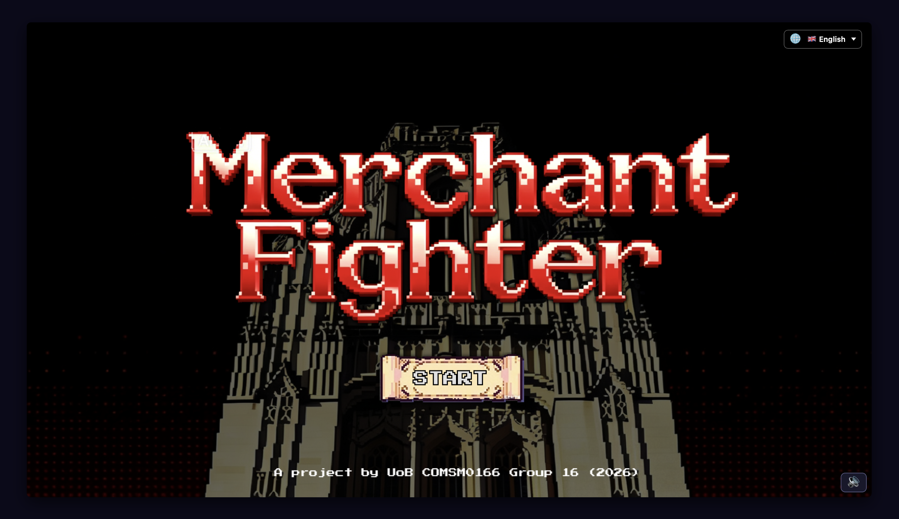

/Merchant Fighters/ is a two-player real-time strategy-come-shooter from the well-loved artillery genre. Classically, the artillery format is turn-based with players taking aim along simple ballistic trajectories. Our work extends this in two ways:
- Replacing a turn-based state machine with continuous player, AI input
- Replacing ballistic with reflective physics trajectories, allowing projectiles to richochet off hard surfaces and game boundaries

The artillery genre is one of earliest computer game formats. The earliest known example, /War 3/ (1965) was text-based and written in FOCAL. Subsequent art was produced for Microsoft BASIC, the Apple II and Comodore PET. The roots of this format predates UNIX, C  and possibly RISC architectures. Our version /Merchant Fighter/, pits these technologies, and the lecturers that teach them, against each other in a battle set within Merchan Ventures itself, where last HP standing takes all.

* DONE Requirements                                    :target_750w:rubic_15:
** DONE Concept
We considered self-determination theory (Ryan & Deci, 2000) as applied to games by using Przybylski et al. Motivational Model of Video Game Engagement (2010) to search for and evaluate concepts.

Our [[file:./docs/assignments/week1-ideas.md][shortlist]] of ideas is not exhuastive: missing many  genres including economic reasoning (/Stardew Valley/), moral choice (/80 Days/) and rhythm (/Beat Sabre/). It is however broad enough to cover the major psychological challenge types relevant to games.

| Genre            | Description                   | Primary Need | Area of challenge            |
|------------------+-------------------------------+--------------+------------------------------|
| Gallery shooter  | e.g. /Duck Hunt/, /Archery/       | Competence   | Active Inference (Friston)   |
|------------------+-------------------------------+--------------+------------------------------|
| Artillery        | e.g. /Worms/, /Scorched Earth/    | Competence   | Analytical Reasoning         |
|------------------+-------------------------------+--------------+------------------------------|
| Social Deduction | e.g. /Among Us/, /Werewolf/       | Relatedness  | Theory of Mind (Baron-Cohen) |
|------------------+-------------------------------+--------------+------------------------------|
| Puzzles          | e.g. /Jenga/, /Tetris/            | Competence   | Visuospatial Reasoning       |
|------------------+-------------------------------+--------------+------------------------------|
| Platformers      | e.g. /The Illusionist's Dream/  | Autonomy     | Narrative and Embodiment     |
|------------------+-------------------------------+--------------+------------------------------|
| Hyper-casual     | e.g. /Fruit Ninja/, /Angry Birds/ | Competence   | Pattern Recognition          |

We narrowed this list to [[file:./docs/assignments/week2-game-ideas.md][two candidates]]: /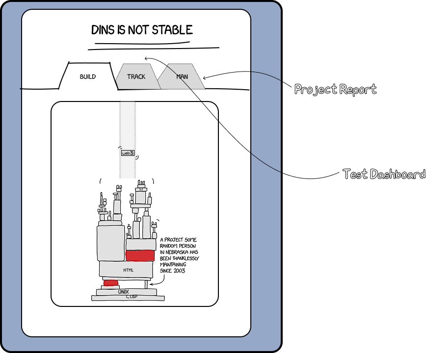 and Artillery/ on the basis of technical feasibility and the SDTs covered. From here, we developed a paper prototype for both. As a team we playtested both paper prototypes and made our final selection using a weighted decision matrix (Pugh, 1991) with a criteria derived from the project brief, SDTs and the paper prototype session.

Scores were given on 1-5 scale and /Artillery/ was ultimately selected as the winner. We felt the adversarial component of /Artillery/ produced more social and engaging play than /Puzzle/. We also thought the design possibilities: weapon variety, terrain, opponent strategy etc. were more open to development. This was important as we knew we had to develop two 'twists'.

[[file:./docs/assignments/week3-paper-prototype/idea-A/demo(CAT).mp4][Paper Prototype Video]]

| Criterion                      | Weight | Puzzles | Artillery |
|--------------------------------+--------+---------+-----------|
| Technical feasibility          |    20% |       4 |         4 |
| SDT breadth (needs engaged)    |    20% |       2 |         4 |
| Playability (playtesting, n=6) |    25% |       3 |         4 |
| replayability                  |    20% |       2 |         4 |
| Capacity for novel twists      |    15% |       3 |         4 |
|--------------------------------+--------+---------+-----------|
| Weighted total                 |   100% |    2.75 |      4.00 |

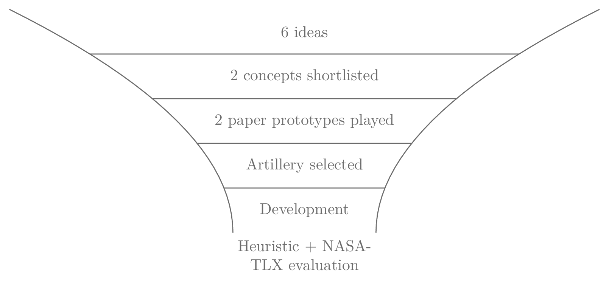

** DONE Stakeholders
We described stakeholders in [[file:./docs/assignments/week4-requirements.md][week4-requirements]] and classified them by /proximity/ to the game using an onion model. Inner rings are stakeholders who touch the code daily; outer rings are those the game reaches once shipped.

** DONE Use Case
Three actors interact with the system: /Player 1/, /Player 2/ and a passive /Spectator/ (anyone watching over-the-shoulder or via the GitHub Pages URL). Players share a keyboard in local multiplayer, so every "player" use case is duplicated for P1 and P2. The use-case set is derived from the screen flow in [[file:./docs/design/ui_flow.md][design/ui_flow.md]].

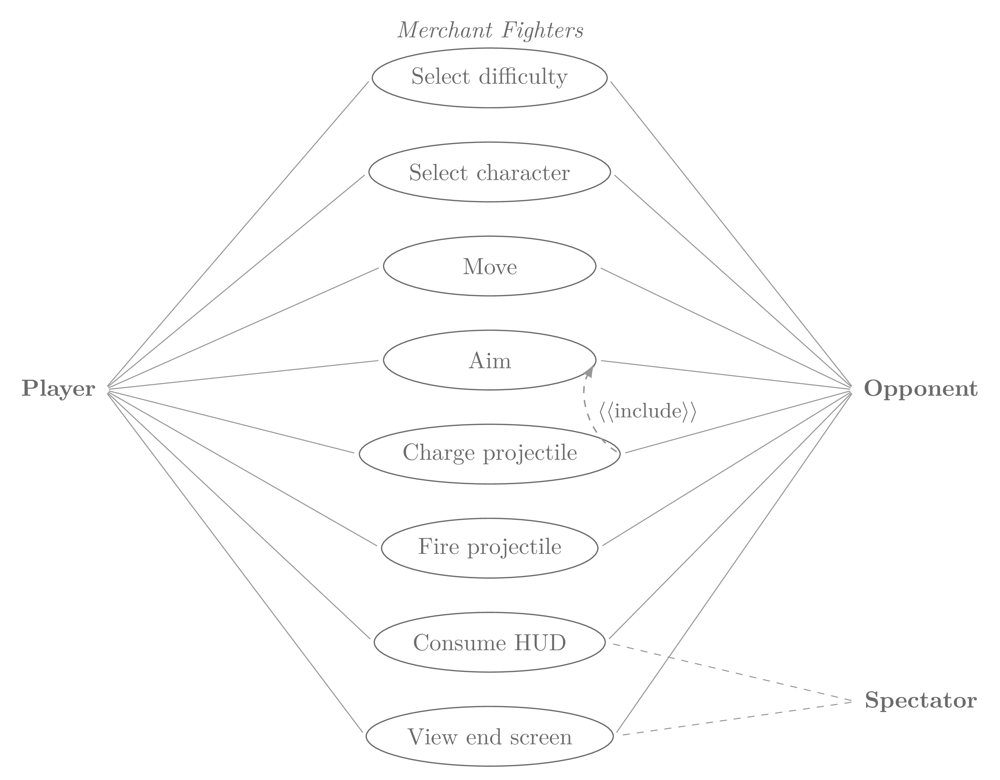

** DONE User Stories
Stories are lifted from the Week 4 requirement workshop. ([[file:Week4_Requirements][Week4_Requirements]]) and re-formatted to:
/As a <role>, I want <goal> so that <value>/

With one gherkin-style acceptance criterion each.

User stories and epics all descend from a goal to build a two-player continuous-input artillery game  that is fair, responsive, and recognisable as Bristol:

- *US-01. Frequent gamer: responsive input.* As a frequent gamer, I want aim/charge/fire input to feel immediate, so that moment-to-moment play is satisfying.
  - /Given/ the battle screen is active, /When/ I press my charge key, /Then/ the on-screen power meter begins filling within 1 frame (≤ 17 ms at 60 FPS).
- *US-02. Frequent gamer: novel mechanic.* As a frequent gamer, I want mechanics beyond basic  artillery, so that the game doesn't feel derivative.
  - /Given/ my projectile hits a wall at angle /θ/, /when/ reflective physics is enabled, /then/ it rebounds at angle /−θ/ rather than despawning. /(Blocked on §4.3.)/
- *US-03. Casual gamer: low learning curve.* As a casual gamer, I want clear on-screen hints, so that I can start playing without reading docs.
  - /Given/ the battle screen has just opened, /When/ I look at the HUD, /Then/ per-player key bindings are displayed distinctly on the left (P1) and right (P2) sides.
- *US-04. UoB student: recognisable setting.* As a UoB student, I want the battle arena to feel  familiar, so that play feels situated.
  - /Given/ the game is running, /When/ I view the background, /Then/ I can identify the Merchant Venturers building silhouette within 10 seconds.
- *US-05. Lecturers: likeness control.* As a real-life figure portrayed in the game, I want opt-in consent for my likeness, so that my public persona is protected.
  - /Given/ a lecturer has not opted in, /When/ the character-select screen renders, /Then/ a generic sprite is shown in their slot
- *US-08. Accessibility:  reduced flashing.* As a player with photosensitivity, I want a "reduce flashing" toggle, so that ricochets do not trigger a visual reaction.
  - /Given/ reduce-flashing is ON, /When/ a projectile ricochets, /Then/ no full-screen white flash occurs within any 100 ms window.

** DONE Priorities
MoSCoW below, with stories scoped to reflect term times and Easter break. /Must/ items reflect course requirements and/or professional pride. /Should/ items will land during the final sprint; /Could/ items are realistic within two more weeks; /Won't/ items are explicitly and unfortunatley deferred.

| Priority | Story | Requirement                                | Status as of 2026-04-22      |
|----------+-------+--------------------------------------------+------------------------------|
| MUST     | US-01 | Responsive continuous input (both players) | Done                         |
| MUST     | US-03 | Per-player HUD                             | In-progress: single-line HUD |
| MUST     | US-06 | Crash-free 30-min session                  | Passes smoke test            |
| MUST     | US-07 | Branch protection + conventional commits   | Done (=CONTRIBUTING.md=)       |
| SHOULD   | US-02 | Reflective projectile physics              | Done                         |
| SHOULD   | US-04 | Merchant Venturers background art          | Done                         |
| SHOULD   | US-05 | Lecturer opt-in + generic fallback         | Done                         |
| COULD    | US-08 | Reduce-flashing accessibility toggle       | Deferred                     |
| COULD    | —    | Sound design                               | Done                         |
| COULD    | —    | Difficulty × character-selection routes    | Done                         |
| WON'T    | —    | Online multiplayer / WebRTC                | Deferred                     |

* DONE Design                                          :target_750w:rubic_15:
** DONE  Overview
The runtime is a single p5.js page reading a continuous keystate vector and producing a single rendered frame per tick. Three responsibilities are kept separated: /Input/ (what each player is pressing /right now/), /Simulation/ (where the world is, given that input) and /Render/ (paint the world).

The simulation layer holds all game logic: angle, power, projectile motion, collision detection and is only a function of the current input and the previous world state. The render layer is 'dumb', given a world it draws sprites, the HUD  and the background.

This permits a continuous state in the simulation, just a tick that runs every frame for both players.

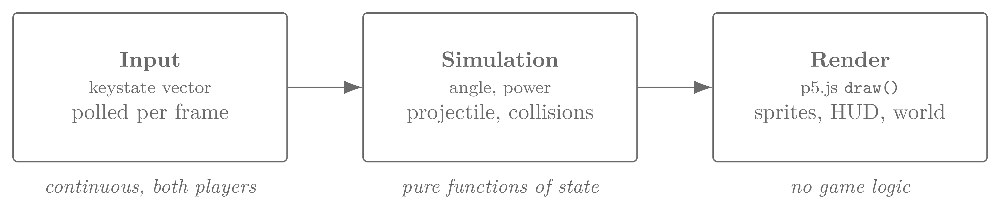

** DONE Classes
The game runtime is shown in figure [[fig:class-diagram]]. /Setup/ acts as root: it owns the /Game Controller/ for the lifetime of the session and dispatches to a /UI Manager/ for rendering. The /Game Controller/ is orchestrator and  polls the /InputHandler/ each frame and manages the lifecycle of the three domain entities (/Player/, /Weapon/, /Projectile/). Methods on the controller (=checkStartGame=, =checkGameOver=, =checkCollision=) implement the continuous-input FSM described, below.

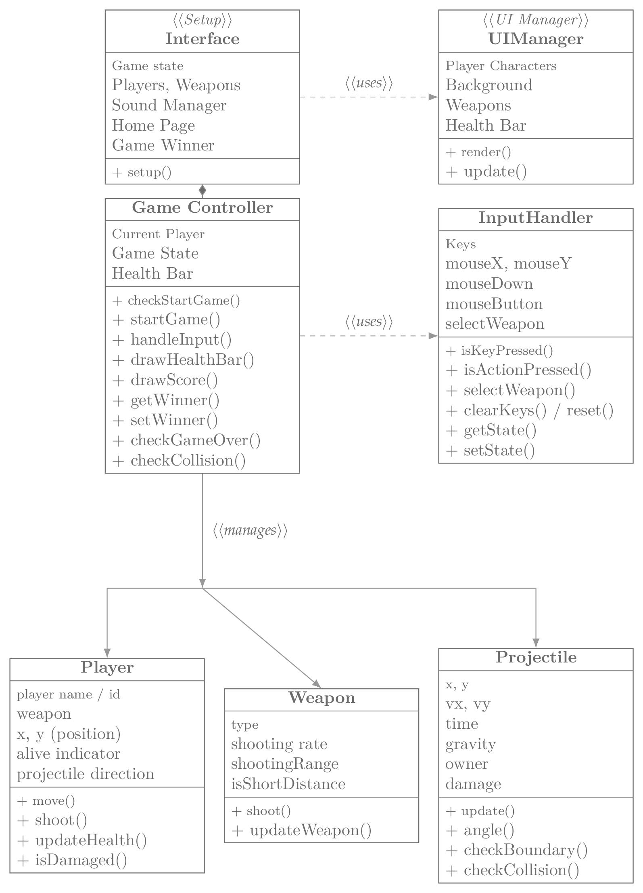

** DONE Behaviours
The behavioural difference between classical artillery and our game is captured in figure [[fig:fsm-contrast]]. A normal FSM treats players as mutually-exclusive: the active player passes through /Aim, Charge/ and /Fire/ and then /Wait for opponent/, during which their input is ignored. Our game removes wait state and runs two parallel regions, one per player, each ticking every frame, such that both players' inputs are sampled simultaneously.

[[file:docs/report/figures/fsm_contrast.png]]

A representative end-to-end interaction is shown in figure [[fig:sequence]]: P1 presses /fire/, the GameController consults InputHandler, spawns a Projectile owned by P1 and that projectile then ticks itself each frame, ricochets off a wall  and finally collides with P2.

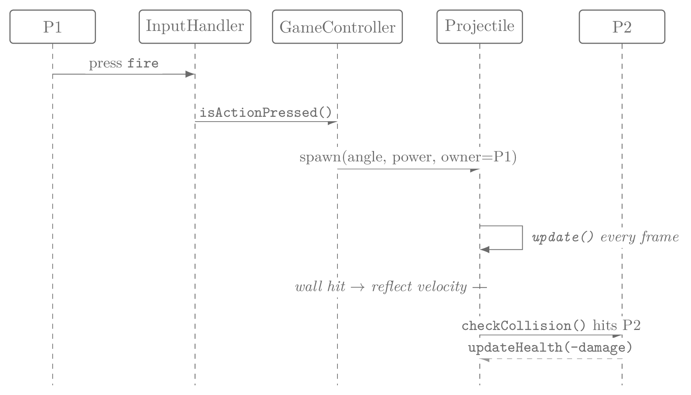

** DONE Art Style
The game is set on a 1920×1080 canvas in pixel art, with two parallel art routes selected by difficulty. /Easy/ and /Medium/ occur across Fantasy Route: a Western-fantasy castle aesthetic with bow-and-arrow combat.

#+CAPTION: John (left pair) and Kira (right pair). Top row: Fantasy portraits and sprites. Bottom row: Modern Route equivalents.
#+NAME: fig:characters-1
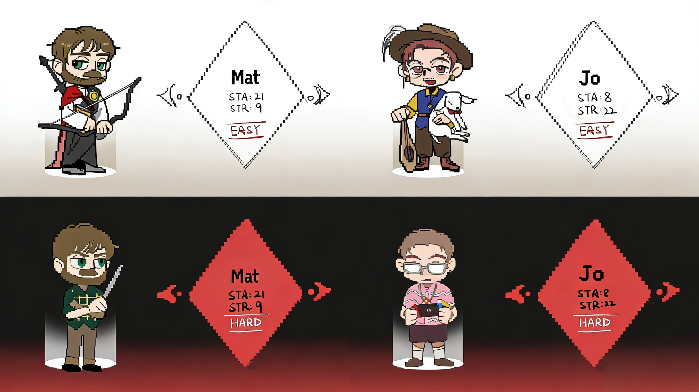

/Hard/ runs occurs across a modern style: a contemporary computer-lab classroom with paper-scroll, red-pen and error-popup projectiles representing pedagogical hazard. Four lecturer-come-characters: =John= =Kira=, =Matt= and =Jo= are drawn in both routes (figure [[fig:characters-1]] shows John and Kira; figure [[fig:characters-2]] shows Mat and Jo). The same character has a Fantasy portrait and a "serious" Modern portrait so that the route choice carries through to character select before the player reaches the battle screen.

#+CAPTION: Mat (left pair) and Jo (right pair), Fantasy and Modern routes.
#+NAME: fig:characters-2
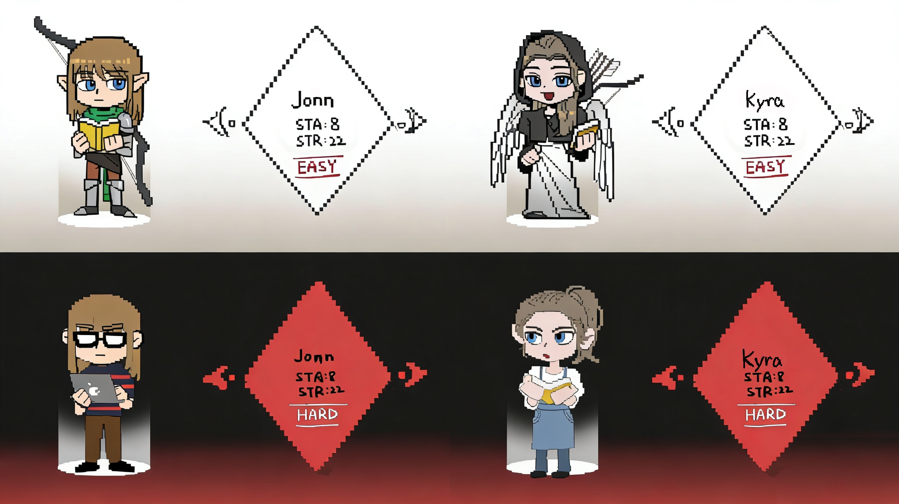

The Battle Screen layout (figure [[fig:battle-scene]]) is shared across routes but the background, character outfits and projectile sprites differ. The Fantasy battle is a candlelit interior whereas the Modern battle is a populated computer lab with the lecturer firing purple pixel projectiles at the player.

#+CAPTION: Battle Screen, both routes. Left: Fantasy Route (vaulted interior, bow-and-arrow). Right: Modern Route (computer lab, projectile sprites).
#+NAME: fig:battle-scene
[[file:docs/design/battle-scene.jpg]]

The full screen-navigation graph is given in figure [[fig:screen-flow]]: from /Start/ the player chooses difficulty, which gates into the corresponding character-select carousel and from there  into the matching battle and finally to a shared Victory/Defeat screen with /Restart/ and /Main Menu/ branches.

#+CAPTION: Screen-navigation flow. Easy/Medium routes through the Fantasy character select and battle; Hard routes through the Modern equivalents. Both terminate at a shared Victory/Defeat screen which loops back to either Difficulty Select (Restart) or Start Screen (Main Menu).
#+NAME: fig:screen-flow
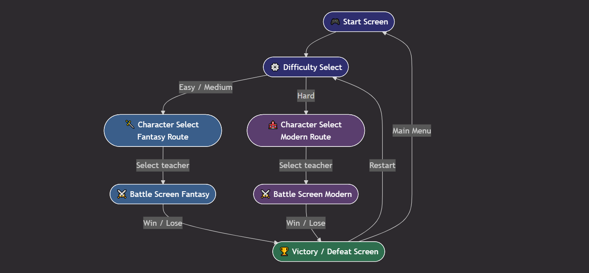

A complete asset inventory including  backgrounds, portraits, sprite sheets, weapons/projectiles and buttons is maintained in =docs/design/ArtAssetList.md= and tracked for completion in =docs/design/asset-tracker.xlsx=.

* TODO Implementation                               :target_750w:weight_15pc:
** DONE Overview
The game is a single-page p5.js application. Entry is =whitebox-prototype/index.html=, which loads a vendored p5.js=, =p5.sound.min.js=, and our own =sketch.js= (725 lines at time of writing). Deployment is GitHub Pages from the repository's =docs/= folder.

p5.js shaped our archirectual decisions:: one =setup()= for boot, one =draw()= for per-frame tick, with three supporting classes:  =ANGLE= (aim), =POWER= (charge), and =CollisionDetection= (world) encapsulate the bits that benefit from encapsulation. We added a Nix flake (=flake.nix=, =flake.lock=) so the dev shell is reproducible across machines: anyone who runs ~nix develop~ and gets identical Node + http-server versions.

** DONE Opponent AI

The first challenge was developing the opponent AI component of the continuous state machine. Chiefly:
•⁠  ⁠Logic for realistic behaviour across difficulty levels
•⁠  ⁠Behaviour composition which we  split into movement (stafing) and shooting strategies

The following approaches were considered for strafing behaviour

1.⁠ ⁠Maintaining a fixed distance between the human player and the ai player so that ai player will move according to human player
Issue: very robotic behaviour and movement is not smooth + sudden change of direction leading to ai player producing ineffective attacks (e.g. attacking against the wall instead of the opponent)

2.⁠ ⁠Random wandering of the ai player + random shooting frequency
Issue: using random() to control the movement would lead to abrupt changes of movement direction of the ai within the same frame of the screen thus introducing jittering issue. On the other hand, given shooting frequency is random, this would lead to ineffective attacks (e.g. low attack frequency + insufficient charging of the attack, resulting in the attack not properly shooting to the opposite side of the screen)

3.⁠ ⁠Introduced
a. movement intent mechanisms
Resulted behavior: no abrupt changes of movement direction within the same frame
b. lock movement during charging logic
Resulted behavior: depending on the hit chance of each level, most of the attacks will be effective and have enough power to reach the opposite side
c. force shot after dedicated time limit logic
Resulted behavior: ensure the frequency of attack -> player wont be bored by the game
d. Escape projectiles mechanism
Resulted behavior: ai player is not wandering randomly but is designed to move based on stimulations from human player -> more reasonable and smooth movement

Going through the above stages, we ensure the enemy behavior of the ai is more human-like and enhanced the sense of immersion of the game even in the single player mode

** DONE Ricochet physics
The second challenge is /reflective/ projectile physics: shots ricochet off walls rather than detonating on impact. The physics pipeline is three-stage per frame:

1. *Integrate*
Explicit Euler with gravity (=900 px/s²=) and a horizontal wind term (=50 px/s²=), clamped by a =dt= cap of 33 ms to prevent issues when the tab regains focus:
   #+BEGIN_SRC javascript
   p.vx += this.windAccel * dt;   // horizontal bias
   p.vy += this.gravity   * dt;   // gravitational pull
   p.x  += p.vx * dt;
   p.y  += p.vy * dt;
   #+END_SRC
2. *Broad* Phase
A uniform spatial grid (128-px cells, hashed as ~"cx,cy"~) prunes static-body candidates to just the handful of cells the projectile overlaps. Grid build (~addStaticRect~ → ~_insertToGrid~) runs once at setup; per-frame queries are O(1) in cell count:
   #+BEGIN_SRC javascript
   _getCellRangeForAABB(aabb) { /* cx/cy range */ }
   _queryNearbyAABB(aabb)     { /* return id Set */ }
   #+END_SRC
3. *Narrow* Phase
Circle-vs-AABB intersection returns both a contact point and a surface /normal/:
   #+BEGIN_SRC javascript
   static circleAABBHit(circle, rect) {
     const cx = clamp(circle.x, rect.x, rect.x + rect.w);
     const cy = clamp(circle.y, rect.y, rect.y + rect.h);
     const dx = circle.x - cx, dy = circle.y - cy;
     if (dx*dx + dy*dy > circle.r*circle.r) return null;
     const normal = (Math.hypot(dx, dy) > 1e-6)
       ? vecNorm({ x: dx, y: dy }) : vec2(0, -1);
     return { point: { x: cx, y: cy }, normal };
   }
   #+END_SRC

The aim-trajectory preview runs the same integrator in a loop  so the yellow dotted arc on screen shows an accurate forward prediction and not a more aesthetic option like Bézier.

#+BEGIN_SRC javascript
const hit = CollisionDetection.circleAABBHit(p, stat);
if (hit) { p.alive = false; return; }
#+END_SRC

Finally, the reflection of a ricochet is given by:

where /v/ is the incoming velocity vector, /ň/ is the unit surface normal at the point of collision, and /v'/ is the reflected velocity.

** TODO Assets
TODO
* DONE Evaluation                                     :target_750w:weight_15:
** DONE Qualitative
We ran Nielsen's Ten Usability Heuristics (Nielsen 1994)7 and recorded the findings in ~docs/Week7_HeuristicEvaluation.pdf~. Each issue was scored along  Nielsen's three-factor severity dimensions (/Frequency/, /Impact/, /Persistence/, each 0–4) and reduced to a composite of severity (/F + I + P/) / 3 on the same 0–4 scale. Twelve findings were captured:
- nine /negative/
- three /positive/

The three positive findings (aim trajectory visibility, win screen clarity, collision accuracy) all scored 1.0 and all converge on H1 "Visibility of system status". This is evidence that the simulation trajectory  preview and the win-screen block work as intended.

*** DONE Negative Findings
| # | Area       | Issue                                                          | Heuristic                            | Severity |
|---+------------+----------------------------------------------------------------+--------------------------------------+----------|
| 1 | Gameplay   | Unbalanced power between players: unfair advantage             | H4 Consistency                       |      3.3 |
| 2 | Gameplay   | Limited movement restricts gameplay                            | H7 Flexibility and efficiency of use |      3.0 |
| 3 | Gameplay   | Standing at screen edge creates a safe area                    | H5 Error prevention                  |      3.0 |
| 4 | Controls   | Unclear why fire direction is restricted to left/right only    | H2 Match with the real world         |      3.0 |
| 5 | Gameplay   | Game is one-dimensional and becomes boring quickly             | H7 Flexibility and efficiency of use |      3.0 |
| 6 | Gameplay   | No platforms or terrain: players cannot move through the world | H7 Flexibility and efficiency of use |      3.0 |
| 7 | UI         | Instructions not separated per player: confusion?              | H6 Recognition rather than recall    |      3.0 |
| 8 | Characters | No distinct features per character. Why have them?             | H7 Flexibility and efficiency of use |      2.3 |
| 9 | UI         | No visual separation between players on screen                 | H1 Visibility of system status       |      2.0 |

*** DONE H7 Cluster
Four of nine negative findings cite H7 /Flexibility and efficiency of use/, all describing the same underlying lack of aesthetic content. It suggested our development priority should soon priotise art asset creation, which we did.

** DONE Quantitative
User feedback was captured in-session on 10th and 12th March 2026 and resulted in 24 valid responses across game difficulty modes (/Easy/ n=11, /Medium/ n=0 (not sampled), /Hard/ n=13). Our hope was to realise a noticiable difference in perceived challenge between modes as it's known to significantly affect player enjoyment (Alexander et al., 2013).

The workshop introduced the NASA Task Load Index (TLX) instrument for this prupsoe. TLX is known to be a reliable instrument for assessing game difficulty (Hart & Staveland, 1988; Ramkumar et al., 2016; Seyderhelm & Blackmore, 2023). Each respondent completed the six NASA-TLX subscales followed by the System Usability Scale (SUS, Brooke 1996). The TLX instrument was presented on a 0–10 integer Likert, inverted such that higher = worse. See responses in [[*B. NASA-TLX and SUS raw][B. NASA-TLX and SUS raw]].

*** DONE NASA-TLX
| Subscale           | Easy (n=11) | Hard (n=13) |
|--------------------+-------------+-------------|
| Mental demand      |         2.7 |         3.6 |
| Physical demand    |         2.3 |         3.1 |
| Temporal demand    |         4.5 |         5.0 |
| Performance (inv.) |         4.3 |         4.2 |
| Effort             |         5.3 |         6.1 |
| Frustration        |         1.7 |         1.8 |
| /Raw TLX (mean)/     |         /3.5/ |         /4.0/ |
| /Rescaled to 0–100/  |        /34.7/ |        /39.6/ |

Both difficulties sit in the /light-to-moderate/ band against Grier's (2015) median of ~46/100 for interactive tasks. A one-sided Mann-Whitney U test on overall Raw TLX found Hard significantly higher than Easy (U=102, p=0.043), though no individual subscale cleared α=0.05 this is consistent with a small uniform shift across subscales aggregating to a detectable overall effect. /Frustration/ stayed near floor in both modes suggesting the harder route raised cognitive load without irritating respondents.

Mann-Whitney U (one-sided: Hard > Easy):
| Subscale           | Median (Easy) | Median (Hard) |   U |      p |
|--------------------+---------------+---------------+-----+--------|
| Mental demand      |           2.0 |           4.0 |  92 |  0.120 |
| Physical demand    |           2.0 |           2.0 |  83 |  0.257 |
| Temporal demand    |           5.0 |           5.0 |  84 |  0.232 |
| Performance (inv.) |           4.0 |           3.0 |  74 |  0.465 |
| Effort             |           5.0 |           6.0 |  90 |  0.129 |
| Frustration        |           1.0 |           1.0 |  74 |  0.461 |
| Raw TLX (overall)  |           3.2 |           3.7 | 102 | 0.043* |

#+CAPTION: NASA-TLX subscale means by difficulty (0–10 raw Likert). /Performance/ is shown inverted so higher = worse for all six bars. Hard increases  /Mental/, /Physical/, /Temporal/ and /Effort/ uniformly; /Frustration/ low in both modes.
#+NAME: fig:tlx-bars

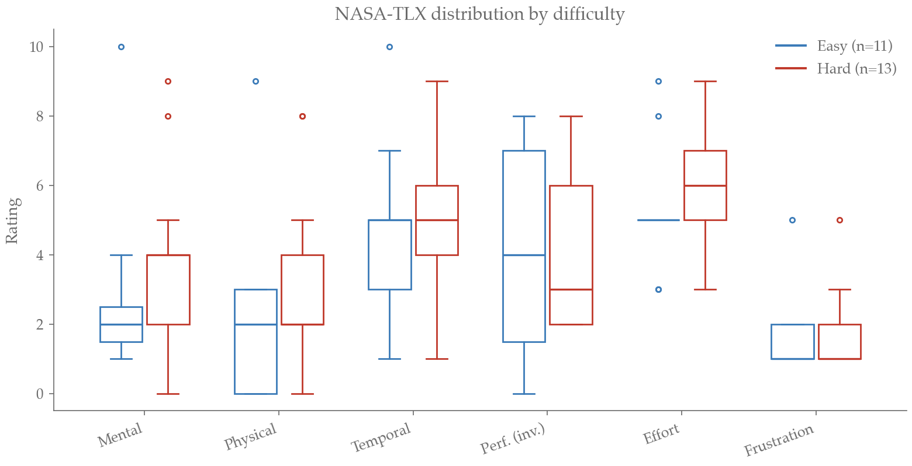

*** DONE System Usability Scale
Scored per Brooke (1996):  odd = positive: /x/−1,  even = negative: 5−/x/, sum × 2.5 -> 0–100).

| Statistic          | Easy (n=11) | Hard (n=13) |
|--------------------+-------------+-------------|
| Mean               |        78.4 |        78.8 |
| Median             |        82.5 |        82.5 |
| Min                |        57.5 |        45.0 |
| Max                |       100.0 |       100.0 |

Where mean SUS ≈ 68, "good" ≥ 73, "excellent" ≥ 85, both modes sit comfortably in the /good/ band with individual sessions reaching /excellent/. The convergence of Easy and Hard means are interesting: difficulty did not penalise perceived usability, consistent with the TLX Frustration floor above.

*** DONE Limitations
- Sample: small /n/ (n = 24) with self-selecting playtesters, which surely skew toward technically minded given they are computer science students
- Drift: TLX was shortened to raw ratings (no pairwise weighted step) so scores are /RAW-TLX/ in Byers/Bittner (1989) terms and not the weighted original
- Order: respondents were not counter-balanced across difficulty
** DONE Test Strategy
Testing on this project is /pragmatic/ not /exhaustive/ but comprises both an automated and manual test strategy.
*** *Automated Testing*
We analysed /method-level/ coverage using a runtime probe. Every method on the protototype of each test target was wrapped in a conuter and the suite was invoked. Methods whose counter remained '0' were recorded as unexercised.

| Class              | Methods covered |    % |
|--------------------+-----------------+------|
| ANGLE              | 2 / 2           | 100% |
| POWER              | 3 / 3           | 100% |
| CollisionDetection | 9 / 11          |  82% |
| WEAPONS            | 3 / 3           | 100% |
| AutoPlayer         | 6 / 27          |  22% |
| Navigator          | 4 / 7           |  57% |
| Language           | 2 / 2           | 100% |
|--------------------+-----------------+------|
| *Total*              | *29 / 55*         |  *53%* |
|                    |                 |      |

The total (/53%)/ is dragged down by a single class: =AutoPlayer= which is heavily asserted in some areas but has 21 as yet untested private helpers. AI development and our class,  =AutoPlayer=, was a new experience for us and as a result we were learning and experimenting as we went. In this context, TTD while ideal, is quite difficult to achieve in practice.

Treating =AutoPlayer= as an outlier, our class average is 88% with the simulation classes achieving  full coverage. With probe instrumentation in place =runAll()= reports *129 / 137 assertions passing (94.2%)*

*Limitations*
Method coverage is a proxy. The probe records whether a method is ever called. Comprehensive line-by-line and branch coverage would require something more sophisticated like Jest.

*** *Manual Testing*
1. Exploratory Play: each merged feature is walked through at the Thursday workshop; defects surface as Jira tasks (61 created, 56 Done)
2. Heuristic review: one session, all ten heuristics, twelve findings
3. Quantitative playtest: The TLX + SUS instrument can be used as a regression test in future

*Smoke-Test Matrix*

| # | Scenario                           | P1 | P2 | Predicted outcome         | Predicted status |
|---+------------------------------------+----+----+---------------------------+------------------|
| 1 | Charge from rest to release        | ✓  | ✓  | Projectile spawns, flies  | Pass             |
| 2 | Charge above cap                   | ✓  | ✓  | =POWER= clamps at max=100   | Pass             |
| 3 | Aim at ceiling or floor            | ✓  | ✓  | =ANGLE= clamps to [0°, 80°] | Pass             |
| 4 | Projectile vs opponent             | ✓  | ✓  | −15 HP, "-15" float text  | Pass             |
| 5 | Projectile vs wall                 | ✓  | ✓  | Projectile despawns       | No               |
| 6 | Projectile vs ground               | ✓  | ✓  | Despawn, turn rotates     | Pass             |
| 7 | Both players charge simultaneously | ?  | ?  | Both spawn in same frame  | ?                |
| 8 | HP reaches 0                       | ✓  | ✓  | Win-screen overlay drawn  | Pass             |

* TODO Process                                      :target_750w:weight_15pc:
** DONE Workflow
Our way of working was codified in [[file:CONTRIBUTING.md][docs/CONTRIBUTING.md]] at the start of the project and is briefly summarised, here. We tried to take an empirical approach to selecting processes. This is because despite the popularity of many "modern" software focussed project management methodologies e.g. Scrum, SAFe and (to a lesser extent) Kanban, empirical evidence of their value remains uncertain.

For example, SAFe has not shown, in any rigorous sense, to outperform alternatives. This includes in the enterprise contexts for which it was designed (Conboy & Caroll, 2019). Systematic reviews of Scrum and Kanban productivity find that the relationship may be positive but the evidence remains limited and is composed largely of anecdotal case studies. These studies are often published by consultancy organisations with a related business interest. (Cardozo et al., 2010; Ahmad et al., 2018).

DORA, however, is the largest and longest running research programme on software practice. What we know from a decade of DORA surveys is that the stability of software and the speed of development is highly and positively correllated. This suggests the technical capabalities underlying a process is a significant factor in successful outcomes. With that in mind, we tried to implement a number of good dev-ops practices, focussing mainly on =continuous intergration and deployment= and =docs-as-code=.

*Branching*
We seelected a standard trunk-based git strategy using short-lived feature branches. =Main= is always deployable (we hope) and feature branches fork main, accumulate commits following =feature/<issue-number>-short-description= (or =Fix/…= for bug fixes) and ideally merge back, quickly.  At the time of writing the repo has four live branches. The development branch of this report is =report= and is rebased periodically from =Main=.

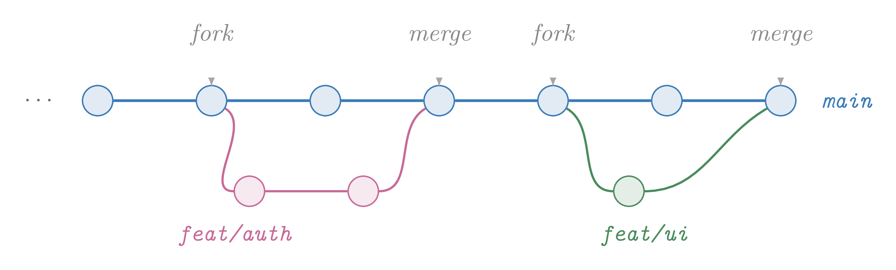

*Pull requests*
Each PR must branch from =main= and reference a Jira issue (=Closes SE-42=). Mirroring issue slugs and pull-request IDs is extremely important for orchestrating dependencies and raising bug tickets, in particular. Finally, a PR must collect at least one approving review before a squash-merge. The /Definition of Done/ checklist in CONTRIBUTING.md is reproduced below and functions as a /contract/:

#+BEGIN_QUOTE
A feature is done when:
- [ ] Code complete and working locally
- [ ] Unit tests pass
- [ ] Linting passes (=npm run lint=)
- [ ] PR reviewed and approved
- [ ] Merged to =main=
- [ ] CI pipeline succeeds
#+END_QUOTE

We used =git merge --squash= to collapse commits on a feature branch into a single new commit on =main=. We are quite inexperienced so this strategy served us well, it means noisy commits (looking at you /Fix: add final fix to fix the last attempt at finally fixing typo/) don't pollute main and therefore the mainline history is easier to read.

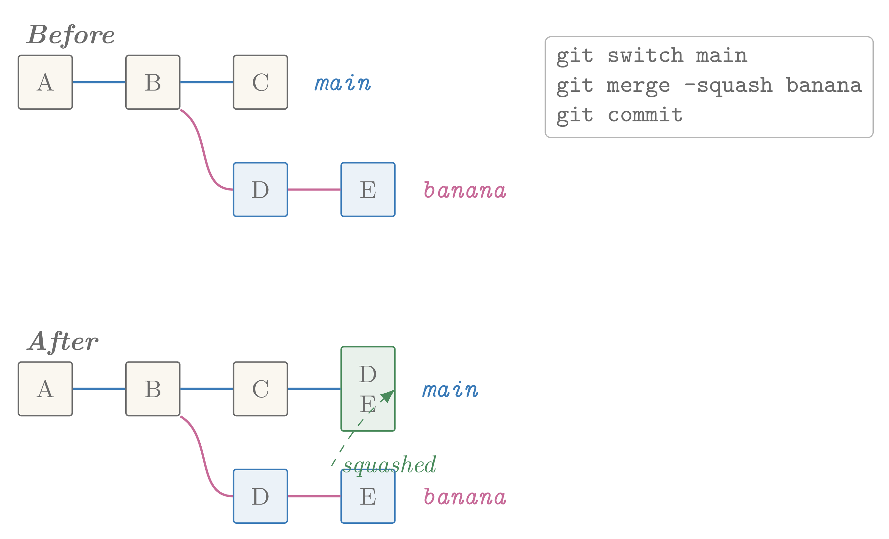

*Issue Transitions*
Tickets flow forward through four states; any non-terminal state can regress one step backward (e.g. a QA failure returns the ticket to /In Progress/) and any state can be closed as /Won't Do/.

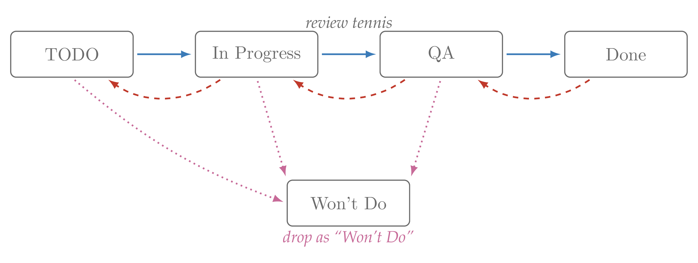

*Agile Ceremonies*
An implicit requirement of sprints is a syncronised schedule between team members. Given demands from other modules and the =MSc summer project= in particular, we considered this an unrealistic assumption. Instead, we adopted a kanban process with a minimum of one weekly check-in, aligned with the Thursday workshop.

*Docs as Code*
All design and planning material are under version control and where possible offered in plain-text. For example, this report is an example of literate programming, which is to say, the source code and the report text are 'tangled' in the same file. This means what the project does (source) and why it does it (report), evolve together. Further examples of docs-as-code, include:

Commits:  [[https://www.conventionalcommits.org/][Conventional Commits]] are enforced by =commitlint= via a pre-commit hook. Types in use: =feat=, =fix=, =docs=, =refactor=, =chore=, =test=. Commit descriptions must use the imperative tense (/"add jump mechanic"/, not /"added…"/). In future we could use these semantically rich  commits for user documentation or to generate and circulate change-logs.

In software engineering, architectural decisions are design decisions that address system-level requirements; they are considered hard to make (Fowler, M., 2003) and expensive to change (Booch, 2016). Architectual Decision Records (ADRs) is a formal document, used to capture significant decisions made during the design and development of software system. ADRs are growing in popularity and are being utilsied by gov.uk, RedHat - among others.

Ahmeti et al. (2024) show that difficulties in creating a documentation culture, transferring knoweledge and prioritising which information to document can be well addresserd by ADRs. They find cooperation between developers improve as a result of using them.

Our decisions are stored in =docs/adr/= as numbered [[https://cognitect.com/blog/2011/11/15/documenting-architecture-decisions][Nygard-template]] markdown files. See starting ADR ([[file:adr/0000-use-adrs.md][docs/adr/0000-use-adrs.md]]) in place.

#+BEGIN_QUOTE
- *Title*: Short noun phrase (in filename and heading)
- *Status*: Proposed, accepted, deprecated, or superseded
- *Context*: The forces at play, stated neutrally
- *Decision*: What we will do, stated in active voice
- *Consequences*: All effects (positive, negative, neutral)
#+END_QUOTE

** DONE Tools
Github was selected on our behalf as project repository and we chose  Jira for issue tracking. We chose not to use Github's built-in issue tracker, choosing to accept a small increase in task-switching overhead and complexity in exchange for exposure to an industry standard tool. Such that it is.

However, we reisted this approach for communications and stuck to Whatsapp instead of Slack or Microsoft Teams. Referencing the first principle of the Agile Manifesto
#+BEGIN_QUOTE
"Individuals and interactions over processes and tools"
#+END_QUOTE

We felt it would be better, where possible, for the tool to "meet us where we are". We all use Whatsapp socially and felt our response time would be quicker by staying on the platform. Note, because we use ~Docs-as-Code~ we had no difficulty surfacing and tracking important textual material.

** DONE Metrics
*** DONE Issue Tracking
Numbers below are derived from a live query of the Jira Cloud REST API for project ~SE~ on =tangiprapulla.atlassian.net= and =git log= on the GitHub repository, aggregated 2026-04-22. The analysis script (Appendix F) pulls the Atlassian API token from 1Password on demand so credentials are not exposed in plain text.

| Measure                              |    Value |
|--------------------------------------+----------|
| Total issues                         |       67 |
| Issue type                           | all Task |
| Status: Done                         |       61 |
| Status: In Progress                  |        2 |
| Status: To Do                        |        4 |
| Completion rate                      |    91.0% |
| Assigned issues                      |       50 |
| Unassigned issues                    |       17 |
| Distinct assignees                   |        6 |
| Status-change transitions (all time) |      106 |

Creation cadence by month (issue `created` timestamp):

|   Month | Issues created |
|---------+----------------|
| 2026-01 |              8 |
| 2026-02 |             12 |
| 2026-03 |             32 |
| 2026-04 |             15 |

There is a noticable spike in active during the month of March  (branch =SE-15-Continuous-Two-Player-Input= opened 2026-03-08) where roughly half the project's tickets were raised and what is potentially indictive of 'crunch'.

*** DONE Assignee Distribution
| Assignee             | Issues |
|----------------------+--------|
| Helen Wong           |     11 |
| Ziquan Liu           |     10 |
| Prapulla Naidu Tangi |      9 |
| Josh Thompson        |      8 |
| Rishabh Gautam       |      7 |
| Ciyang Weng          |      5 |
| /(Unassigned)/         |     17 |

The top-to-bottom ratio across assigned work is 2.2×, indicating a modest skew (Gini ≈ 0.14 over the six assignees). The 17 unassigned tickets (25% of the backlog) are mostly research or documentation spikes and have not been picked up by an owner at aggregation time.

*** DONE Git Activity
=git log --oneline= at the time of writing records 84 commits across 4 branches by 6 contributors and peak commit months mirror the Jira pattern.

#+CAPTION: Cumulative flow for project SE. Blue = issues created; green = issues transitioned to Done; red band = work-in-flight.
#+NAME: fig:jira-cumulative
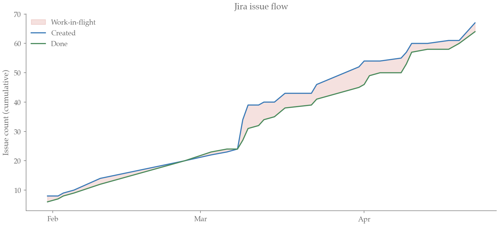

** TODO Reflection
- containerisation?
- Literate environments e.g. Nix
- Linters
- AB Testing
- Unit testing
- Refactoring
- git usage

* TODO Sustainability                                           :target_500w:
** TODO Approach
I have no idea what I'm doing.

TODO
We applied the /Sustainability Awareness Framework (SusAF)/ across three? dimensions: =Social, Individual, Environmental, Economic, Technical= and three orders of effect  =immediate=, =enabling= and =structural=. For each dimension the framework prescribes five standard topics which our analysis conforms to.

** TODO Impact analysis
TODO
Populate each cell from the team's SusAD workshop output. A  chain = /immediate fact -> enabling behaviour -> structural change/.

*** TODO Social
*** TODO Individual
*** TODO Environmental
*** TODO Economic
*** TODO Technical
** TODO Chain-of-effects (SusAD)
FIG: hand-drawn or rendered SusAD showing  one chain per dimension

** TODO Threats, opportunities, and actions
TODO: 2×2  table

** TODO Sustainability user stories and acceptance criteria
TODO: 3–5 stories added to Jira, each related  to the chain above. Example:

- As a player with photosensitive epilepsy, I want a "reduce flashing" toggle so that I can play without triggering symptoms. Acceptance: Given reduce-flashing is ON, when a projectile ricochets, then no full-screen white flash occurs within any 100 ms window.

** TODO Green Software Foundation patterns applied
We need to select ~3 patterns from
https://patterns.greensoftware.foundation/catalog/ and explain how they were integrated.

| Pattern                                         | Applied in | How |
|-------------------------------------------------+------------+-----|
| TODO: e.g. "Avoid high-resolution images"       | TODO       | TODO |
| TODO: e.g. "Cache static data"                  | TODO       | TODO |
| TODO: e.g. "Reduce the frequency of polling"    | TODO       | TODO |

** TODO Accessibility and Ethics
TODO
- *Accessibility*
  - keyboard-only by design; need remap UI, colour-blind palette check, subtitles for dialogue box, "reduce flashing" toggle.
  - Chinese and English language support
- *Ethics*
  real-person likeness: depicting named lecturers in combat raises consent and reputational concerns. Policy: we provided opt-in per lecturer;
  neutral "generic" sprites as fallback.
* TODO Conclusion                                     :target_500w:weight_10:
** TODO Lessons
TODO
** TODO Immediate
TODO: missing sound, missing end-state screens, difficulty routes

** TODO Future
TODO: multiplayer-over-WebRTC, A/B testing/unit tests, CI/CD

* TODO Contribution statement
The team has a diversity of lived professional and academic experience from all over the world. This includes .NET development, game development, finance and behavioural research. However, we tried where possible, to assign work according to our interests as well as our strengths.

| Name                 | Role          | Key contributions                      |
|----------------------+---------------+----------------------------------------|
| Helen Wong           | TODO          | TODO                                   |
| Prapulla Naidu Tangi | TODO          | TODO                                   |
| Rishabh Gautam       | TODO          | TODO                                   |
| Ciyang Weng          | TODO          | TODO                                   |
|----------------------+---------------+----------------------------------------|
| Josh Thompson        | Documentation | CONTRIBUTING.md, analysis, README.org, |
|                      |               | puzzle game concept, continuous FSM    |
|----------------------+---------------+----------------------------------------|
| Ziquan Liu           | UI Programmer | TODO                                   |

** AI Statement

| Name           | Usage                                                                                                  |
|----------------+--------------------------------------------------------------------------------------------------------|
| Josh Thompson  | I used NotebookLLM for parsing and summarising literature on research methods.                         |
|                | I used Claude for learning and debugging LaTex and structuring an API query to Jira.                   |
|                | I used Claude to write: a piece of regex and to link my bibliography to the inline citations, post-hoc |
|----------------+--------------------------------------------------------------------------------------------------------|
| Helenm Wong    |                                                                                                        |
|----------------+--------------------------------------------------------------------------------------------------------|
| Prapulla Tangi |                                                                                                        |
|----------------+--------------------------------------------------------------------------------------------------------|
| Rishabh Gautam |                                                                                                        |
|----------------+--------------------------------------------------------------------------------------------------------|
| Ciyang Weng    |                                                                                                        |
|----------------+--------------------------------------------------------------------------------------------------------|
| Ziquan Liu     |                                                                                                        |
|                |                                                                                                        |

* TODO References
TODO: BibTeX-style list. Notes:
- Munroe, R. (2020). xkcd #2347 "Dependency".
- Penzenstadler, B. et al. (2014). The Karlskrona Manifesto.
- Becker, C. et al. (2015). Sustainability Design and Software.
- Hart, S. G. & Staveland, L. E. (1988). NASA-TLX.
- Nielsen, J. (1994). Ten Usability Heuristics.

Becker, C. et al. (2015) ‘Sustainability design and software: The Karlskrona Manifesto’, 2015 IEEE/ACM 37th IEEE International Conference on Software Engineering. doi:10.1109/icse.2015.179.

Cardozo, E. S. F., Araújo Neto, J. B. F., França, A. C. C., & da Silva, F. Q. B. (2010). SCRUM and Productivity in Software Projects: A Systematic Literature Review. Proceedings of the 14th International Conference on Evaluation and Assessment in Software Engineering (EASE).

Ahmad, M. O., Dennehy, D., Conboy, K., & Oivo, M. (2018). Kanban in Software Engineering: A Systematic Mapping Study. Journal of Systems and Software, 137, 96–113.

Hart, S. G., & Staveland, L. E. (1988). Development of NASA-TLX (Task Load Index): Results of empirical and theoretical research. Advances in Psychology, 139–183. https://doi.org/10.1016/s0166-4115(08)62386-9.

* DONE Appendices
** DONE A. Figures
Sources under =docs/design/=, exports under =docs/figures/=.

#+CAPTION: Ideation funnel for /Merchant Fighters/. Six ideas were collected in Week 1 which were  narrowed to two xconcept pairs in Week 2, both paper-prototyped in Week 3 and the artillery concept selected for the Week 4–7 development.
#+NAME: fig:idea-funnel
#+HEADER: :results file graphics :file docs/report/figures/funnel.png :imagemagick yes
#+HEADER: :iminoptions -density 300 -background none -alpha remove
#+HEADER: :imoutoptions -quality 90
#+HEADER: :headers '("\\usepackage{./docs/report/styles/tufte}")
#+HEADER: :fit yes :border 2mm
#+BEGIN_SRC latex
% Source - https://www.printlnhello.world/blog/marketing-funnels-in-latex/
% Retrieved 2026-04-27

\begin{tikzpicture}
    % Funnel shape
    \foreach \sgn in {-,+}
        \draw plot[domain=0:5] ({\sgn 1/5*(8+\x*\x)},\x);
    % Funnel stages
    \foreach \h in {1,2,3,4}
        \draw ({-1/5*(8+\h*\h)},\h) -- ({1/5*(8+\h*\h)},\h);
    % Labels
    \node at (0,4.5) {6 ideas};
    \node at (0,3.5) {2 concepts shortlisted};
    \node at (0,2.5) {2 paper prototypes played};
    \node at (0,1.5) {Artillery selected};
    \node at (0,0.5) {Development};
    \node[text width=4.5cm, align=center] at (0,-0.5) {Heuristic + NASA-TLX evaluation};
\end{tikzpicture}
#+END_SRC

#+CAPTION: Stakeholder onion for /Merchant Fighters/.
#+NAME: fig:stakeholder-onion
#+HEADER: :results file graphics :file docs/report/figures/onion.png :imagemagick yes
#+HEADER: :iminoptions -density 600 -background none
#+HEADER: :imoutoptions -quality 100
#+HEADER: :headers '("\\usepackage{./docs/report/styles/tufte}")
#+HEADER: :fit yes :border 2mm
#+BEGIN_SRC latex
% Source - https://tex.stackexchange.com/a/51230
% Posted by percusse
% Retrieved 2026-04-27, License - CC BY-SA 3.0
\begin{tikzpicture}[every node/.style={align=center}]
  % Rings (outer to inner so inner draws over outer)
  \draw[ink] (0,0) circle (4.2);
  \draw[ink] (0,0) circle (3.2);
  \draw[ink] (0,0) circle (2.2);
  \draw[ink] (0,0) circle (1.2);
  % Inner-ring label
  \node at (0,0) {\textbf{Group 16}\\(6 students)};
  % Ring 2 label (module staff + playtesters)
  \node at (0, 1.7) {Module staff};
  \node at (0,-1.7) {Playtesters (n=24)};
  % Ring 3 label (Lecturers + UoB)
  \node at (-2.7, 0) {Lecturer\\characters};
  \node at ( 2.7, 0) {UoB students\\(target users)};
  % Ring 4 label (future classes + public)
  \node at (0, 3.7) {Future COMSM0166 classes};
  \node at (0,-3.7) {General public\\(GitHub Pages visitors)};
\end{tikzpicture}
#+END_SRC

#+RESULTS: fig:stakeholder-onion

#+CAPTION: UML use-case diagram. Both players share the same use-case set (aim, charge, fire, move, consume HUD) but bind distinct keys; the Spectator has a read-only view onto the Battle and Victory/Defeat screens.
#+NAME: fig:use-case
#+HEADER: :results file graphics :file docs/report/figures/use_case.png :imagemagick yes
#+HEADER: :iminoptions -density 600 -background none
#+HEADER: :imoutoptions -quality 100
#+HEADER: :headers '("\\usepackage{./docs/report/styles/tufte}")
#+HEADER: :fit yes :border 2mm
#+BEGIN_SRC latex
\begin{tikzpicture}
  % Title
  \node (title) at (0, 5.4) {\textit{Merchant Fighters}};

  % Use cases: relative positioning, 0.5cm gap between ellipses
  \node[uc]                       (sel-d) at (0, 4.7) {Select difficulty};
  \node[uc, below=0.5 of sel-d]   (sel-c)             {Select character};
  \node[uc, below=0.5 of sel-c]   (move)              {Move};
  \node[uc, below=0.5 of move]    (aim)               {Aim};
  \node[uc, below=0.5 of aim]     (charge)            {Charge projectile};
  \node[uc, below=0.5 of charge]  (fire)              {Fire projectile};
  \node[uc, below=0.5 of fire]    (hud)               {Consume HUD};
  \node[uc, below=0.5 of hud]     (end)               {View end screen};

  % Actors: pushed out, vertically centred
  \node[actor] (p1) at (-6.5,  0)    {\textbf{Player}};
  \node[actor] (p2) at ( 6.5,  0)    {\textbf{Opponent}};
  \node[actor] (sp) at ( 6.5, -4.7)  {\textbf{Spectator}};

  % Associations: anchor at sides so lines don't emerge from text
  \foreach \u in {sel-d, sel-c, move, aim, charge, fire, hud, end}
    \draw[association] (p1.east) -- (\u.west);
  \foreach \u in {sel-d, sel-c, move, aim, charge, fire, hud, end}
    \draw[association] (p2.west) -- (\u.east);

  % Spectator: read-only view
  \draw[association, dashed] (sp.west) -- (hud.east);
  \draw[association, dashed] (sp.west) -- (end.east);

  % <<include>>: charging includes aiming — routed around the right
  \draw[include] (charge.east) to[bend left=45]
      node[midway, right, font=\small] {$\langle\langle$include$\rangle\rangle$}
      (aim.east);
\end{tikzpicture}
#+END_SRC

#+CAPTION: Three part architecture
#+NAME: fig:three-layer
#+HEADER: :results file graphics :file docs/report/figures/three_layer.png :imagemagick yes
#+HEADER: :iminoptions -density 600 -background none
#+HEADER: :imoutoptions -quality 100
#+HEADER: :headers '("\\usepackage{./docs/report/styles/tufte}")
#+HEADER: :fit yes :border 2mm
#+BEGIN_SRC latex
\begin{tikzpicture}[
  layer/.style = {draw=ink, rounded corners=2pt,
                  minimum width=4.4cm, minimum height=2.4cm,
                  align=center, font=\rmfamily},
  arr/.style   = {-{Latex[length=3mm]}, draw=ink},
  caption/.style = {font=\small\rmfamily\itshape, color=ink, text width=4cm,
                    align=center},
]
  \node[layer] (input)
    {\textbf{Input}\\ \footnotesize keystate vector\\ polled per frame};
  \node[layer, right=1.2cm of input] (sim)
    {\textbf{Simulation}\\ \footnotesize angle, power\\ projectile, collisions};
  \node[layer, right=1.2cm of sim] (render)
    {\textbf{Render}\\ \footnotesize p5.js \texttt{draw()}\\ sprites, HUD, world};

  \draw[arr] (input)  -- (sim);
  \draw[arr] (sim)    -- (render);

  \node[caption, below=4pt of input]  {continuous, both players};
  \node[caption, below=4pt of sim]    {pure functions of state};
  \node[caption, below=4pt of render] {no game logic};
\end{tikzpicture}
#+END_SRC

#+CAPTION: Class diagram for /Merchant Fighters/. Filled diamond denotes composition; dashed arrows denote /uses/; solid arrows denote /manages/.
#+NAME: fig:class-diagram
#+HEADER: :results file graphics :file docs/report/figures/class_diagram.png :imagemagick yes
#+HEADER: :iminoptions -density 300 -background none
#+HEADER: :imoutoptions -quality 100
#+HEADER: :headers '("\\usepackage{./docs/report/styles/tufte}" "\\usetikzlibrary{calc}")
#+HEADER: :fit yes :border 2mm
#+BEGIN_SRC latex
\begin{tikzpicture}

  % Boundary / orchestration layer
  \umlclass{setup}{-5,5}{Setup}{Interface}
    {Game state\\ Players, Weapons\\ Sound Manager\\ Home Page\\ Game Winner}
    {+ setup()}

  \umlclass{ui}{2,5}{UI Manager}{UIManager}
    {Player Characters\\ Background\\ Weapons\\ Health Bar}
    {+ render()\\ + update()}

  % Application core
  \umlclass{ctrl}{-5,0}{}{Game Controller}
    {Current Player\\ Game State\\ Health Bar}
    {+ checkStartGame()\\ + startGame()\\ + handleInput()\\ + drawHealthBar()\\
     + drawScore()\\ + getWinner()\\ + setWinner()\\ + checkGameOver()\\
     + checkCollision()}

  \umlclass{input}{2,0}{}{InputHandler}
    {Keys\\ mouseX, mouseY\\ mouseDown\\ mouseButton\\ selectWeapon}
    {+ isKeyPressed()\\ + isActionPressed()\\ + selectWeapon()\\
     + clearKeys() / reset()\\ + getState()\\ + setState()}

  % Domain entities (managed by the controller) -- pushed lower for clearance
  \umlclass{player}{-7,-9}{}{Player}
    {player name / id\\ weapon\\ x, y (position)\\ alive indicator\\
     projectile direction}
    {+ move()\\ + shoot()\\ + updateHealth()\\ + isDamaged()}

  \umlclass{weapon}{-2.5,-9}{}{Weapon}
    {type\\ shooting rate\\ shootingRange\\ isShortDistance}
    {+ shoot()\\ + updateWeapon()}

  \umlclass{proj}{2,-9}{}{Projectile}
    {x, y\\ vx, vy\\ time\\ gravity\\ owner\\ damage}
    {+ update()\\ + angle()\\ + checkBoundary()\\ + checkCollision()}

  % Relationships
  \draw[uml-compose] (setup.south) -- (ctrl.north);

  \draw[uml-uses] (setup.east) -- node[above, font=\small\itshape]
    {$\langle\langle$uses$\rangle\rangle$} (ui.west);

  \draw[uml-uses] (ctrl.east) -- node[above, font=\small\itshape]
    {$\langle\langle$uses$\rangle\rangle$} (input.west);

% Trunk-and-branch routing for the manages relationship
 \coordinate (junction) at ($(ctrl.south) + (0,-2.4)$);
  \draw[uml-manages] (ctrl.south) -- (junction)
    node[midway, right=2pt, font=\small\itshape]
    {$\langle\langle$manages$\rangle\rangle$};
  \draw[uml-manages] (junction) -| (player.north);
  \draw[uml-manages] (junction) -- (weapon.north);
  \draw[uml-manages] (junction) -| (proj.north);

\end{tikzpicture}
#+END_SRC

#+CAPTION: Classical vs our continuous-input model
#+NAME: fig:fsm-contrast
#+HEADER: :results file graphics :file docs/report/figures/fsm_contrast.png :imagemagick yes
#+HEADER: :iminoptions -density 300 -background none
#+HEADER: :imoutoptions -quality 100
#+HEADER: :headers '("\\usepackage{./docs/report/styles/tufte}" "\\usetikzlibrary{calc,fit}")
#+HEADER: :fit yes :border 2mm
#+BEGIN_SRC latex
\begin{tikzpicture}[
  state/.style = {draw=ink, rounded corners=2pt,
                  minimum width=2.0cm, minimum height=0.7cm, align=center,
                  font=\rmfamily, inner sep=3pt},
  trans/.style = {-{Latex[length=2mm]}, draw=ink!70},
  region/.style = {draw=ink!50, dashed, rounded corners=4pt, inner sep=10pt},
  flabel/.style = {font=\rmfamily\itshape\small, color=ink},
]

  % Turn-based
  \node[flabel] at (-4.5, 4.4) {turn-based};
  \node[state] (c-aim)    at (-4.5,  3.2) {Aim};
  \node[state] (c-charge) at (-4.5,  2.0) {Charge};
  \node[state] (c-fire)   at (-4.5,  0.8) {Fire};
  \node[state, draw=ink!50, font=\itshape\rmfamily]
       (c-wait) at (-4.5, -0.7) {wait for\\opponent};

  \draw[trans] (c-aim)    -- (c-charge);
  \draw[trans] (c-charge) -- (c-fire);
  \draw[trans] (c-fire)   -- (c-wait);
  \draw[trans] (c-wait.east) to[bend right=55] (c-aim.east);
  \node[flabel, text width=4cm, align=center]
       at (-4.5, -2.4) {};

  % Continuous
  \node[flabel] at (3.0, 4.4) {Continuous};

  \node[state] (n1-aim)    at (1.5,  3.2) {Aim};
  \node[state] (n1-charge) at (1.5,  2.0) {Charge};
  \node[state] (n1-fire)   at (1.5,  0.8) {Fire};
  \draw[trans] (n1-aim)    -- (n1-charge);
  \draw[trans] (n1-charge) -- (n1-fire);
  \draw[trans] (n1-fire.west) to[bend left=55] (n1-aim.west);
  \node[region, fit=(n1-aim) (n1-charge) (n1-fire),
        label={[flabel, anchor=south]south:P1}] (r1) {};

  \node[state] (n2-aim)    at (4.5,  3.2) {Aim};
  \node[state] (n2-charge) at (4.5,  2.0) {Charge};
  \node[state] (n2-fire)   at (4.5,  0.8) {Fire};
  \draw[trans] (n2-aim)    -- (n2-charge);
  \draw[trans] (n2-charge) -- (n2-fire);
  \draw[trans] (n2-fire.east) to[bend right=55] (n2-aim.east);
  \node[region, fit=(n2-aim) (n2-charge) (n2-fire),
        label={[flabel, anchor=south]south:P2}] (r2) {};

  \node[flabel, text width=4.5cm, align=center]
       at (3.0, -2.4) {};
\end{tikzpicture}
#+END_SRC

#+CAPTION: A standard gameplay sequence.
#+NAME: fig:sequence
#+HEADER: :results file graphics :file docs/report/figures/sequence.png :imagemagick yes
#+HEADER: :iminoptions -density 300 -background none
#+HEADER: :imoutoptions -quality 100
#+HEADER: :headers '("\\usepackage{./docs/report/styles/tufte}" "\\usetikzlibrary{calc}")
#+HEADER: :fit yes :border 2mm
#+BEGIN_SRC latex
\begin{tikzpicture}[
  lifeline/.style = {draw=ink, dashed, line width=0.4pt},
  msg/.style      = {-{Latex[length=2mm]}, draw=ink, line width=0.4pt},
  return/.style   = {-{Latex[length=2mm]}, dashed, draw=ink!70, line width=0.4pt},
  actor/.style    = {draw=ink, rectangle, rounded corners=2pt,
                     minimum width=1.8cm, minimum height=0.7cm,
                     font=\rmfamily, inner sep=4pt},
  msglabel/.style = {font=\small\rmfamily, color=ink, fill=white, inner sep=2pt},
  note/.style     = {font=\small\rmfamily\itshape, color=ink, fill=white, inner sep=2pt},
]
  \node[actor] (p1)    at ( 0, 0) {P1};
  \node[actor] (input) at ( 3, 0) {InputHandler};
  \node[actor] (ctrl)  at ( 6, 0) {GameController};
  \node[actor] (proj)  at ( 9, 0) {Projectile};
  \node[actor] (p2)    at (12, 0) {P2};

  \foreach \n in {p1, input, ctrl, proj, p2}
    \draw[lifeline] (\n.south) -- ($(\n.south) + (0,-7.2)$);

  \draw[msg] (p1.south    |- 0,-1) -- node[msglabel, above]{press \texttt{fire}}                   (input.north |- 0,-1);
  \draw[msg] (input.south |- 0,-2) -- node[msglabel, above]{\texttt{isActionPressed()}}            (ctrl.north  |- 0,-2);
  \draw[msg] (ctrl.south  |- 0,-3) -- node[msglabel, above]{spawn(angle, power, owner=P1)}        (proj.north  |- 0,-3);

  % Self-loop: per-frame update tick
  \draw[msg] ($(proj.south |- 0,-4.2)$) -- ++(0.9,0) -- ++(0,-0.5) -- ++(-0.9,0);
  \node[note, anchor=west] at ($(proj.south |- 0,-4.45) + (1.0,0)$) {\texttt{update()} every frame};

  % Wall hit (state mutation, not a message)
  \node[note, anchor=east] at ($(proj.south |- 0,-5.5) + (-0.2,0)$) {wall hit $\rightarrow$ reflect velocity};
  \draw[ink, line width=0.4pt]
    ($(proj.south |- 0,-5.5) + (-0.15,0)$) -- ($(proj.south |- 0,-5.5) + (0.15,0)$);

  \draw[msg]    (proj.south |- 0,-6.5) -- node[msglabel, above]{\texttt{checkCollision()} hits P2} (p2.north |- 0,-6.5);
  \draw[return] (p2.south   |- 0,-7.0) -- node[msglabel, above]{\texttt{updateHealth(-damage)}}    (proj.north |- 0,-7.0);
\end{tikzpicture}
#+END_SRC

#+CAPTION: Trunk-based development with short-lived feature branches.
#+NAME: fig:branch-strategy
#+HEADER: :results file graphics :file docs/report/figures/branch_strategy.png :imagemagick yes
#+HEADER: :iminoptions -density 600 -background none
#+HEADER: :imoutoptions -quality 100
#+HEADER: :headers '("\\usepackage{./docs/report/styles/tufte}" "\\usetikzlibrary{calc}")
#+HEADER: :fit yes :border 2mm
#+BEGIN_SRC latex
% Citation
% Git SCM Cheat Sheet: https://git-scm.com/cheat-sheet

\begin{tikzpicture}[
    commit/.style    = {circle, draw=ink, fill=paper, line width=0.5pt,
                        minimum size=4mm, inner sep=0pt},
    maincmt/.style   = {commit, fill=accentBlue!15, draw=accentBlue},
    feata/.style     = {commit, fill=accentPink!15, draw=accentPink},
    featb/.style     = {commit, fill=accentGreen!15, draw=accentGreen},
    mainline/.style  = {accent-pos, line width=1pt},
    branchA/.style   = {accent-alt, line width=0.8pt},
    branchB/.style   = {accent-alt2, line width=0.8pt},
    tag/.style       = {font=\small\rmfamily\itshape},
  ]
  % Main trunk
  \foreach \i/\x in {0/0, 1/1.5, 2/3.0, 3/4.5, 4/6.0, 5/7.5, 6/9.0}
    \node[maincmt] (m\i) at (\x, 0) {};
  \foreach \i/\j in {0/1, 1/2, 2/3, 3/4, 4/5, 5/6}
    \draw[mainline] (m\i) -- (m\j);

  \node[tag, accentBlue, right=2mm of m6] {\texttt{main}};
  \node[tag, left=2mm of m0] {$\cdots$};

  % feat/auth: forks at m1, two commits, merges into m3
  \node[feata] (a1) at (2.0, -1.2) {};
  \node[feata] (a2) at (3.5, -1.2) {};
  \draw[branchA] (m1) to[out=-30, in=180] (a1);
  \draw[branchA] (a1) -- (a2);
  \draw[branchA] (a2) to[out=0, in=-150] (m3);
  \node[tag, accentPink, below=1mm of a1, xshift=-2mm] {\texttt{feat/auth}};

  % feat/ui: forks at m4, one commit, merges into m6
  \node[featb] (b1) at (7.0, -1.2) {};
  \draw[branchB] (m4) to[out=-30, in=180] (b1);
  \draw[branchB] (b1) to[out=0, in=-150] (m6);
  \node[tag, accentGreen, below=1mm of b1, xshift=2mm] {\texttt{feat/ui}};

  % Fork/merge annotations
  \node[tag, ink!80, above=4mm of m1] {fork};
  \node[tag, ink!80, above=4mm of m3] {merge};
  \node[tag, ink!80, above=4mm of m4] {fork};
  \node[tag, ink!80, above=4mm of m6] {merge};
  \draw[faint, -{Latex[length=1.2mm]}, shorten >=1pt] ($(m1)+(0,3mm)$) -- ($(m1)+(0,1.5mm)$);
  \draw[faint, -{Latex[length=1.2mm]}, shorten >=1pt] ($(m3)+(0,3mm)$) -- ($(m3)+(0,1.5mm)$);
  \draw[faint, -{Latex[length=1.2mm]}, shorten >=1pt] ($(m4)+(0,3mm)$) -- ($(m4)+(0,1.5mm)$);
  \draw[faint, -{Latex[length=1.2mm]}, shorten >=1pt] ($(m6)+(0,3mm)$) -- ($(m6)+(0,1.5mm)$);
\end{tikzpicture}
#+END_SRC

#+NAME: fig:merge-strategy
#+HEADER: :results file graphics :file docs/report/figures/merge_strategy.png :imagemagick yes
#+HEADER: :iminoptions -density 600 -background none
#+HEADER: :imoutoptions -quality 100
#+HEADER: :headers '("\\usepackage{./docs/report/styles/tufte}" "\\usetikzlibrary{calc,fit}")
#+HEADER: :fit yes :border 2mm
#+BEGIN_SRC latex
% Citation
% Git handbook: https://git-scm.com/book/en/v2/Distributed-Git-Contributing-to-a-Project.html#_private_managed_team
\begin{tikzpicture}[
    cmt/.style       = {draw=ink, line width=0.5pt, rounded corners=1pt,
                        minimum size=7mm, inner sep=1pt, font=\rmfamily\small,
                        fill=paper},
    fcmt/.style      = {cmt, draw=accentBlue, fill=accentBlue!10},
    scmt/.style      = {cmt, draw=accentGreen, fill=accentGreen!12,
                        minimum width=7mm, minimum height=11mm,
                        align=center, font=\rmfamily\small},
    edge/.style      = {accent-pos, line width=0.8pt},
    fedge/.style     = {accent-alt, line width=0.8pt},
    arrow/.style     = {-{Latex[length=2mm]}, draw=ink!70, line width=0.4pt},
    lab/.style       = {font=\rmfamily\itshape},
  ]
  % ===== BEFORE =====
  \node[lab, anchor=west] at (-0.4, 1.6) {\textbf{Before}};
  \node[cmt]  (A) at (0, 1)   {A};
  \node[cmt]  (B) at (1.4, 1) {B};
  \node[cmt]  (C) at (2.8, 1) {C};
  \draw[edge] (A) -- (B);
  \draw[edge] (B) -- (C);
  \node[lab, accentBlue, right=2mm of C] {\texttt{main}};

  \node[fcmt] (D) at (2.8, -0.4) {D};
  \node[fcmt] (E) at (4.2, -0.4) {E};
  \draw[fedge] (B.south east) to[out=-30, in=180] (D.west);
  \draw[fedge] (D) -- (E);
  \node[lab, accentPink, right=2mm of E] {\texttt{banana}};

  % ===== AFTER =====
  \node[lab, anchor=west] at (-0.4, -2.4) {\textbf{After}};
  \node[cmt]  (A2) at (0, -3.0)   {A};
  \node[cmt]  (B2) at (1.4, -3.0) {B};
  \node[cmt]  (C2) at (2.8, -3.0) {C};
  \node[scmt] (DE) at (4.2, -3.0) {D\\E};
  \draw[edge] (A2) -- (B2);
  \draw[edge] (B2) -- (C2);
  \draw[edge] (C2) -- (DE);
  \node[lab, accentBlue, right=2mm of DE] {\texttt{main}};

  \node[fcmt] (D2) at (2.8, -4.4) {D};
  \node[fcmt] (E2) at (4.2, -4.4) {E};
  \draw[fedge] (B2.south east) to[out=-30, in=180] (D2.west);
  \draw[fedge] (D2) -- (E2);
  \node[lab, accentPink, right=2mm of E2] {\texttt{banana}};

  % "squashed" callout
  \node[lab, accentGreen, font=\rmfamily\small\itshape,
        below=1mm of DE.north, anchor=north east, xshift=10mm, yshift=-12mm]
        (sqlabel) {squashed};
  \draw[arrow, accentGreen, dashed] (sqlabel.west) to[bend left=10] (DE.east);

  % Command box
  \node[draw=ink!50, rounded corners=2pt, line width=0.4pt,
        font=\ttfamily\small, align=left, inner sep=4pt,
        anchor=north west] at (6.5, 1.6)
        {git switch main\\
         git merge --squash banana\\
         git commit};
\end{tikzpicture}
#+END_SRC

#+NAME: fig:issue-workflow
#+HEADER: :results file graphics :file docs/report/figures/issue_workflow.png :imagemagick yes
#+HEADER: :iminoptions -density 600 -background none
#+HEADER: :imoutoptions -quality 100
#+HEADER: :headers '("\\usepackage{./docs/report/styles/tufte}" "\\usetikzlibrary{calc}")
#+HEADER: :fit yes :border 2mm
#+BEGIN_SRC latex
\begin{tikzpicture}[
    state/.style = {draw=ink, line width=0.6pt, rounded corners=3pt,
                    minimum width=2.4cm, minimum height=0.9cm, align=center,
                    font=\rmfamily},
    fwd/.style   = {accent-pos, -{Latex[length=2mm]}, shorten >=2pt, shorten <=2pt},
    back/.style  = {accent-neg, -{Latex[length=2mm]}, shorten >=2pt, shorten <=2pt,
                    dashed},
    drop/.style  = {accent-alt, -{Latex[length=2mm]}, shorten >=2pt, shorten <=2pt,
                    dotted},
  ]
  % Forward lane
  \node[state] (todo)  at (0, 0)  {TODO};
  \node[state, right=1.2 of todo]  (prog) {In Progress};
  \node[state, right=1.2 of prog]  (qa)   {QA};
  \node[state, right=1.2 of qa]    (done) {Done};

  % Won't Do sink, centred below
  \node[state, below=2.0 of prog, xshift=1.8cm] (wont) {Won't Do};

  % Forward
  \draw[fwd] (todo) -- (prog);
  \draw[fwd] (prog) -- (qa);
  \draw[fwd] (qa)   -- (done);

  % Backward (curve above)
  \draw[back] (prog) to[bend left=35] (todo);
  \draw[back] (qa)   to[bend left=35] (prog);
  \draw[back] (done) to[bend left=35] (qa);

  % Won't Do drop from any non-terminal state
  \draw[drop] (todo.south) to[bend right=10] (wont.west);
  \draw[drop] (prog.south) -- (wont.north west);
  \draw[drop] (qa.south)   -- (wont.north east);

  % Edge labels
  \node[font=\small\itshape, above=1pt of $(prog)!0.5!(todo)$, yshift=10pt] {};
  \node[font=\small\itshape, above=1pt of $(qa)!0.5!(prog)$,   yshift=10pt] {review tennis};
  \node[font=\small\itshape, above=1pt of $(done)!0.5!(qa)$,   yshift=10pt] {};
  \node[font=\small\itshape, accentPink] at ($(wont)+(0,-0.7)$) {drop as ``Won't Do''};
\end{tikzpicture}
#+END_SRC

#+NAME: fig:ricochet-reflection
#+HEADER: :headers '("\\usepackage{./docs/report/styles/tufte}" "\\definecolor{midgrey}{HTML}{808080}")
#+HEADER: :results file graphics :file docs/report/figures/ricochet_reflection.png :imagemagick yes
#+HEADER: :iminoptions -density 600 -background none
#+HEADER: :imoutoptions -quality 100 -resize 200x
#+HEADER: :fit yes :border 2mm
#+BEGIN_SRC latex
\textcolor{midgrey}{\small\( \mathbf{v'} = \mathbf{v} - 2(\mathbf{v} \cdot \hat{\mathbf{n}})\hat{\mathbf{n}} \)}
#+END_SRC

#+RESULTS: fig:ricochet-reflection

** DONE B. NASA-TLX Data
*** DONE B.1 Easy: TLX (0–10) and SUS (0–100)
|  # | Timestamp   | Mental | Physical | Temporal | Perf | Effort | Frustration |   SUS |
|----+-------------+--------+----------+----------+------+--------+-------------+-------|
|  1 | 10/03 14:24 |     10 |        9 |       10 |   10 |      9 |           5 |  57.5 |
|  2 | 10/03 14:33 |      2 |        2 |        3 |    3 |      5 |           1 |  90.0 |
|  3 | 10/03 14:34 |      1 |        0 |        1 |    8 |      8 |           1 |  87.5 |
|  4 | 10/03 14:37 |      2 |        3 |        7 |    3 |      5 |           2 |  82.5 |
|  5 | 10/03 14:41 |      1 |        0 |        3 |    2 |      5 |           1 |  97.5 |
|  6 | 10/03 14:45 |      3 |        3 |        5 |    8 |      5 |           1 |  77.5 |
|  7 | 12/03 21:46 |      2 |        0 |        5 |    9 |      5 |           1 | 100.0 |
|  8 | 12/03 21:48 |      2 |        0 |        5 |    9 |      5 |           1 |  87.5 |
|  9 | 12/03 21:49 |      2 |        2 |        3 |    2 |      3 |           2 |  65.0 |
| 10 | 12/03 21:50 |      4 |        3 |        5 |    6 |      5 |           2 |  60.0 |
| 11 | 12/03 21:54 |      1 |        3 |        3 |    3 |      3 |           2 |  57.5 |

*** DONE B.2 Hard: TLX (0–10) and SUS (0–100)
| #  | Timestamp       | Mental | Physical | Temporal | Perf | Effort | Frustration |  SUS |
|----+-----------------+--------+----------+----------+------+--------+-------------+------|
|  1 | 10/03 14:25     |      9 |        8 |        6 |    8 |      9 |           5 | 45.0 |
|  2 | 10/03 14:40     |      4 |        1 |        9 |    8 |      5 |           1 | 85.0 |
|  3 | 10/03 14:46     |      4 |        4 |        7 |    7 |      7 |           2 | 82.5 |
|  4 | 10/03 14:52     |      0 |        0 |        4 |    2 |      5 |           1 | 100.0 |
|  5 | 10/03 14:54     |      2 |        5 |        1 |    4 |      4 |           2 | 87.5 |
|  6 | 10/03 15:00     |      0 |        3 |        2 |    4 |      8 |           2 | 92.5 |
|  7 | 10/03 21:04     |      8 |        8 |        6 |    7 |      7 |           1 | 67.5 |
|  8 | 12/03 21:46     |      3 |        2 |        4 |    3 |      3 |           3 | 55.0 |
|  9 | 12/03 21:48     |      4 |        2 |        4 |    3 |      5 |           2 | 62.5 |
| 10 | 12/03 21:49     |      1 |        2 |        4 |    8 |      6 |           1 | 95.0 |
| 11 | 12/03 21:50     |      5 |        2 |        5 |    8 |      8 |           1 | 87.5 |
| 12 | 12/03 21:53     |      3 |        2 |        7 |    7 |      5 |           1 | 82.5 |
| 13 | 12/03 21:53:54  |      4 |        1 |        6 |    6 |      7 |           1 | 82.5 |

** DONE C. Jira Data

Source is query of Jira Cloud REST API at =https://tangiprapulla.atlassian.net/rest/api/3/= for project key ~SE~ (project id ~10002~). The Atlassian API token is held in the author's 1Password (vault =Developer=, item =COMSM1066_listener=) and fetched at analysis time via =op read=, this way I don't expose API keys in commits (or in this appendix)

Endpoints:
- =GET /rest/api/3/search/jql= (=fields=created,status,assignee,issuetype=)
- =GET /rest/api/3/issue/{key}/changelog=

*** DONE Ouput
- =docs/report/data/jira_cumulative.csv=
- =docs/report/figures/jira_cumulative.png=
** DONE D. Paper Prototype
[[file:./docs/assignments/week3-paper-prototype/idea-A/demo(CAT).mp4][Artillery]]
** DONE E. ADRs
[[file:docs/adr/0000-use-adrs.md][docs/adr/]].
** DONE F. Analysis
*** DONE Inputs
~docs/report/data/nasa_tlx_sus.csv~
Fields: =difficulty, timestamp, mental, physical, temporal, performance, effort, frustration, sus=.
Jira Project: ~SE~ on =tangiprapulla.atlassian.net=, queried via REST API.

*** DONE Code
Instructions: first run ~M-x org-babel-tangle~ and then execute ~uv run analyse.py~
#+BEGIN_SRC python :tangle report/analyse.py :mkdirp yes
# /// script
# requires-python = ">=3.11"
# dependencies = [
#   "matplotlib",
#   "numpy",
#   "scipy",
# ]
# ///
from __future__ import annotations
import base64, csv, json, statistics as st, subprocess, urllib.parse, urllib.request
from collections import Counter
from datetime import datetime
from pathlib import Path

import matplotlib
matplotlib.use("Agg")
import matplotlib.dates as mdates
import matplotlib.pyplot as plt
import numpy as np
from matplotlib.lines import Line2D
from scipy.stats import mannwhitneyu

ROOT      = Path(__file__).resolve().parents[2]
NASA_CSV  = ROOT / "docs" / "report" / "data" / "nasa_tlx_sus.csv"
FIG_DIR   = ROOT / "docs" / "report" / "figures"
DATA_DIR  = ROOT / "docs" / "report" / "data"
STYLE     = ROOT / "docs" / "report" / "styles" / "tufte.mplstyle"

plt.style.use(str(STYLE))

TLX_SCALES = ["mental", "physical", "temporal", "performance", "effort", "frustration"]
INK   = "#6B6B6B"
BLUE  = "#3B7BB8"
RED   = "#C0392B"
GREEN = "#4A8B5C"

# 1Password helper

def op_read(ref: str) -> str:
    return subprocess.check_output(["op", "read", ref], text=True).strip()

# NASA-TLX and SUS

def load_nasa(path: Path) -> dict[str, list[dict]]:
    groups: dict[str, list[dict]] = {"Easy": [], "Hard": []}
    for r in csv.DictReader(path.open()):
        for k in TLX_SCALES: r[k] = float(r[k])
        r["sus"] = float(r["sus"])
        groups.setdefault(r["difficulty"], []).append(r)
    return groups

def summarise(rows: list[dict]) -> dict:
    means = {s: st.mean(r[s] for r in rows) for s in TLX_SCALES}
    raw_tlx = st.mean(
        st.mean([r["mental"], r["physical"], r["temporal"],
                 10 - r["performance"], r["effort"], r["frustration"]])
        for r in rows)
    sus = [r["sus"] for r in rows]
    return {"n": len(rows), "means": means, "raw_tlx": raw_tlx,
            "tlx_100": raw_tlx * 10,
            "sus_mean": st.mean(sus), "sus_median": st.median(sus),
            "sus_min": min(sus), "sus_max": max(sus)}

def _tlx_matrix(rows: list[dict]) -> np.ndarray:
    """Rows × subscales, with Performance inverted."""
    m = np.array([[r[s] for s in TLX_SCALES] for r in rows], dtype=float)
    m[:, 3] = 10 - m[:, 3]
    return m

def _tlx_overall(rows: list[dict]) -> np.ndarray:
    """Per-respondent Raw TLX score (mean of six inverted-where-relevant subscales)."""
    return np.array([
        np.mean([r["mental"], r["physical"], r["temporal"],
                 10 - r["performance"], r["effort"], r["frustration"]])
        for r in rows
    ])

def tlx_figure(groups: dict[str, list[dict]], out: Path) -> None:
    """Side-by-side box plots of NASA-TLX subscales by difficulty."""
    labels = ["Mental", "Physical", "Temporal", "Perf. (inv.)", "Effort", "Frustration"]
    easy = _tlx_matrix(groups["Easy"])
    hard = _tlx_matrix(groups["Hard"])

    x = np.arange(len(labels))
    w = 0.35
    fig, ax = plt.subplots(figsize=(8, 4.2))

    def box(data, positions, colour):
        return ax.boxplot(
            [data[:, i] for i in range(data.shape[1])],
            positions=positions, widths=w * 0.9, patch_artist=True,
            medianprops=dict(color=colour, linewidth=1.2),
            boxprops=dict(facecolor="none", edgecolor=colour),
            whiskerprops=dict(color=colour),
            capprops=dict(color=colour),
            flierprops=dict(marker="o", markersize=3,
                            markeredgecolor=colour, markerfacecolor="none"),
        )

    box(easy, x - w/2, BLUE)
    box(hard, x + w/2, RED)

    ax.set_xticks(x)
    ax.set_xticklabels(labels, ha="right")
    ax.set_ylabel("Rating")
    ax.set_ylim(-0.5, 10.5)
    ax.set_title("NASA-TLX distribution by difficulty")
    ax.legend(handles=[Line2D([], [], color=BLUE, label=f"Easy (n={len(easy)})"),
                       Line2D([], [], color=RED,  label=f"Hard (n={len(hard)})")],
              loc="upper right")

    fig.tight_layout(); fig.savefig(out); plt.close(fig)

def tlx_significance(groups: dict[str, list[dict]]) -> list[tuple]:
    """Mann-Whitney U per subscale + overall Raw TLX. One-sided: H1 = Hard > Easy.
    Returns rows of (label, median_easy, median_hard, U, p)."""
    labels = ["Mental demand", "Physical demand", "Temporal demand",
              "Performance (inv.)", "Effort", "Frustration"]
    rows = []
    for label, key in zip(labels, TLX_SCALES):
        e = np.array([r[key] for r in groups["Easy"]], dtype=float)
        h = np.array([r[key] for r in groups["Hard"]], dtype=float)
        if key == "performance":
            e, h = 10 - e, 10 - h
        u, p = mannwhitneyu(h, e, alternative="greater")
        rows.append((label, float(np.median(e)), float(np.median(h)), float(u), float(p)))

    e_o, h_o = _tlx_overall(groups["Easy"]), _tlx_overall(groups["Hard"])
    u, p = mannwhitneyu(h_o, e_o, alternative="greater")
    rows.append(("Raw TLX (overall)",
                 float(np.median(e_o)), float(np.median(h_o)), float(u), float(p)))

    print("Mann-Whitney U (one-sided: Hard > Easy):")
    for lab, me, mh, uu, pp in rows:
        sig = "*" if pp < 0.05 else " "
        print(f"   {lab:<22} med {me:4.1f} -> {mh:4.1f}   U={uu:5.0f}   p={pp:.3f} {sig}")
    return rows

def write_significance_org(rows: list[tuple], out: Path) -> None:
    """Emit an org-mode table you can #+INCLUDE: into the report."""
    with out.open("w") as f:
        f.write("| Subscale | Median (Easy) | Median (Hard) | U | p |\n")
        f.write("|----------+---------------+---------------+---+---|\n")
        for lab, me, mh, u, p in rows:
            star = "*" if p < 0.05 else ""
            f.write(f"| {lab} | {me:.1f} | {mh:.1f} | {u:.0f} | {p:.3f}{star} |\n")

# Jira

JIRA_BASE = "https://tangiprapulla.atlassian.net"

def jira_get(path: str, auth: str, **params) -> dict:
    url = f"{JIRA_BASE}{path}?" + urllib.parse.urlencode(params)
    req = urllib.request.Request(url,
        headers={"Authorization": f"Basic {auth}", "Accept": "application/json"})
    return json.load(urllib.request.urlopen(req))

def jira_pull() -> tuple[list, list]:
    email = op_read("op://Developer/COMSM1066_listener/username")
    token = op_read("op://Developer/COMSM1066_listener/credential")
    auth  = base64.b64encode(f"{email}:{token}".encode()).decode()

    issues, nxt = [], None
    while True:
        params = {"jql": "project = SE ORDER BY created ASC",
                  "fields": "created,status,assignee,issuetype", "maxResults": 100}
        if nxt: params["nextPageToken"] = nxt
        r = jira_get("/rest/api/3/search/jql", auth, **params)
        issues.extend(r["issues"])
        if r.get("isLast", True) or not r.get("nextPageToken"): break
        nxt = r["nextPageToken"]

    events = []   # (date, toStatus)
    for i in issues:
        cl = jira_get(f"/rest/api/3/issue/{i['key']}/changelog", auth, maxResults=100)
        for h in cl.get("values", []):
            for it in h.get("items", []):
                if it.get("field") == "status":
                    events.append((h["created"][:10], it["toString"]))
    return issues, events

def jira_report(issues, events, fig_out: Path, csv_out: Path) -> None:
    statuses  = Counter(i["fields"]["status"]["name"] for i in issues)
    months    = Counter(i["fields"]["created"][:7] for i in issues)
    assignees = Counter((i["fields"]["assignee"] or {}).get("displayName", "Unassigned") for i in issues)
    transitions = len(events)

    print(f"   Total issues       : {len(issues)}")
    print(f"   Done               : {statuses['Done']}")
    print(f"   To Do              : {statuses['To Do']}")
    print(f"   In Progress        : {statuses.get('In Progress', 0)}")
    print(f"   Status transitions : {transitions}")
    print(f"   Completion rate    : {statuses['Done']/len(issues):.1%}")
    print("   Creation by month:")
    for m, n in sorted(months.items()): print(f"     {m}  {n:>3}")
    print("   Assignee distribution:")
    for name, n in assignees.most_common(): print(f"     {name:<22} {n:>3}")

    created_by = Counter(i["fields"]["created"][:10] for i in issues)
    done_by    = Counter(d for d, s in events if s == "Done")
    days       = sorted(set(list(created_by) + list(done_by)))
    cc, cd, xs, cs, ds = 0, 0, [], [], []
    with csv_out.open("w", newline="") as f:
        w = csv.writer(f); w.writerow(["date", "created_cum", "done_cum"])
        for d in days:
            cc += created_by[d]; cd += done_by[d]
            w.writerow([d, cc, cd])
            xs.append(datetime.strptime(d, "%Y-%m-%d")); cs.append(cc); ds.append(cd)

    fig, ax = plt.subplots(figsize=(9, 4.2))
    ax.fill_between(xs, cs, ds, alpha=0.15, color=RED, label="Work-in-flight")
    ax.plot(xs, cs, label="Created")             # blue (1st in cycle)
    ax.plot(xs, ds, color=GREEN, label="Done")   # green; skip red to avoid clashing with WIP fill
    ax.set_ylabel("Issue Cumulative Count")
    ax.set_title("Jira Issue Flow")
    ax.legend(loc="upper left")
    ax.xaxis.set_major_locator(mdates.MonthLocator())
    ax.xaxis.set_major_formatter(mdates.DateFormatter("%b"))
    fig.tight_layout(); fig.savefig(fig_out); plt.close(fig)

# Entry

if __name__ == "__main__":
    FIG_DIR.mkdir(parents=True, exist_ok=True)
    DATA_DIR.mkdir(parents=True, exist_ok=True)

    print("NASA-TLX / SUS")
    groups = load_nasa(NASA_CSV)
    for label, rows in groups.items():
        s = summarise(rows)
        print(f"-- {label}  (n={s['n']}) --")
        for k, v in s["means"].items(): print(f"   {k:<12} {v:4.2f}")
        print(f"   Raw TLX 0-10  : {s['raw_tlx']:4.2f}")
        print(f"   Rescaled 0-100: {s['tlx_100']:4.1f}")
        print(f"   SUS mean/med  : {s['sus_mean']:.1f} / {s['sus_median']:.1f}")
        print(f"   SUS min /max  : {s['sus_min']:.1f} / {s['sus_max']:.1f}")
    tlx_figure(groups, FIG_DIR / "tlx_bars.png")

    sig_rows = tlx_significance(groups)
    write_significance_org(sig_rows, DATA_DIR / "tlx_significance.org")

    print("\n Querying Jira...")
    issues, events = jira_pull()
    jira_report(issues, events,
                FIG_DIR / "jira_cumulative.png",
                DATA_DIR / "jira_cumulative.csv")
#+END_SRC
# Local Variables:
# org-latex-compiler: "lualatex"
# End:
