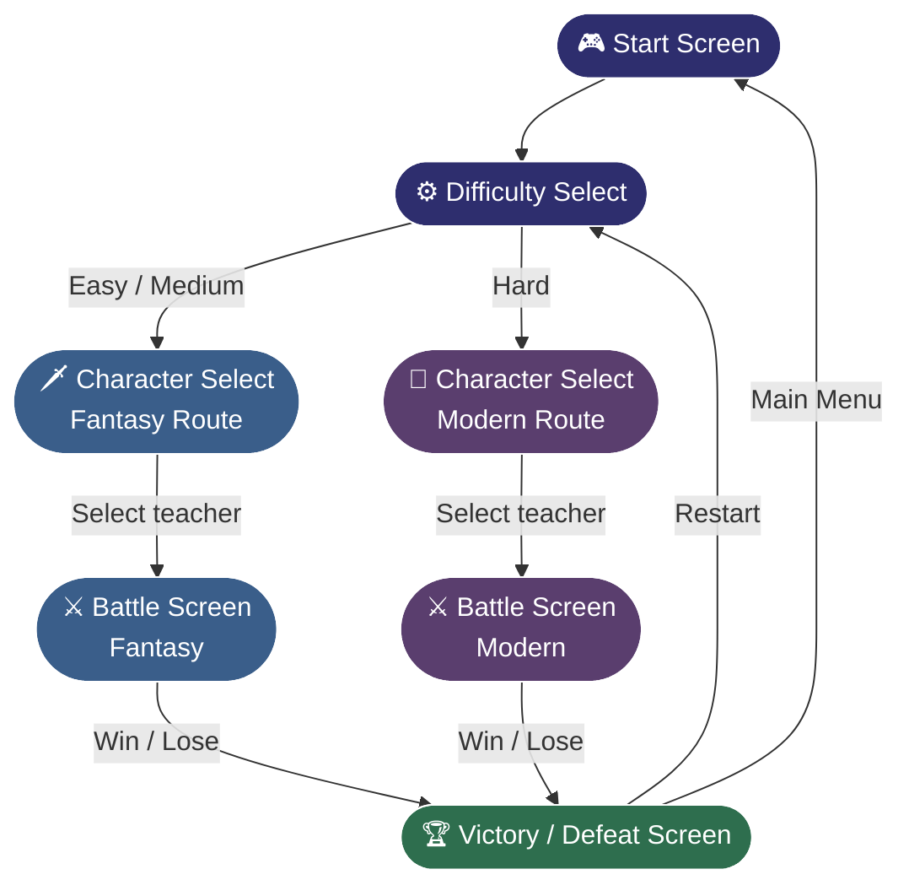
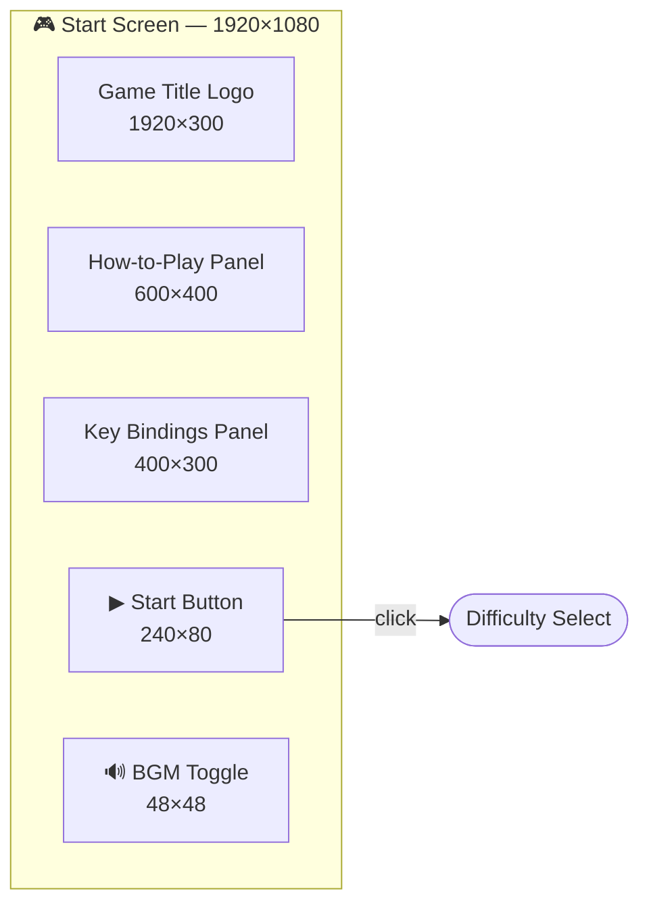
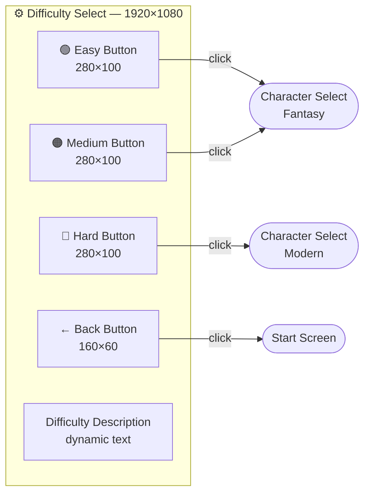
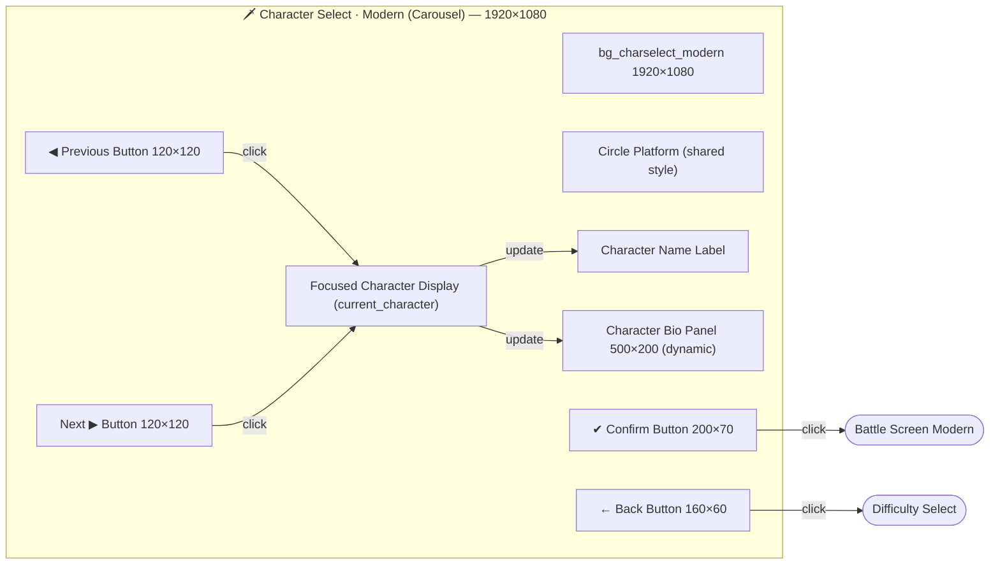
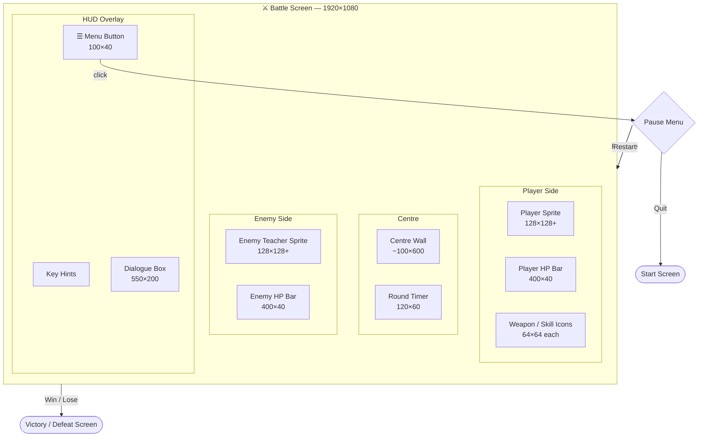
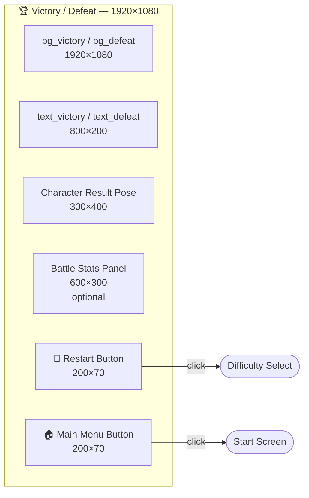
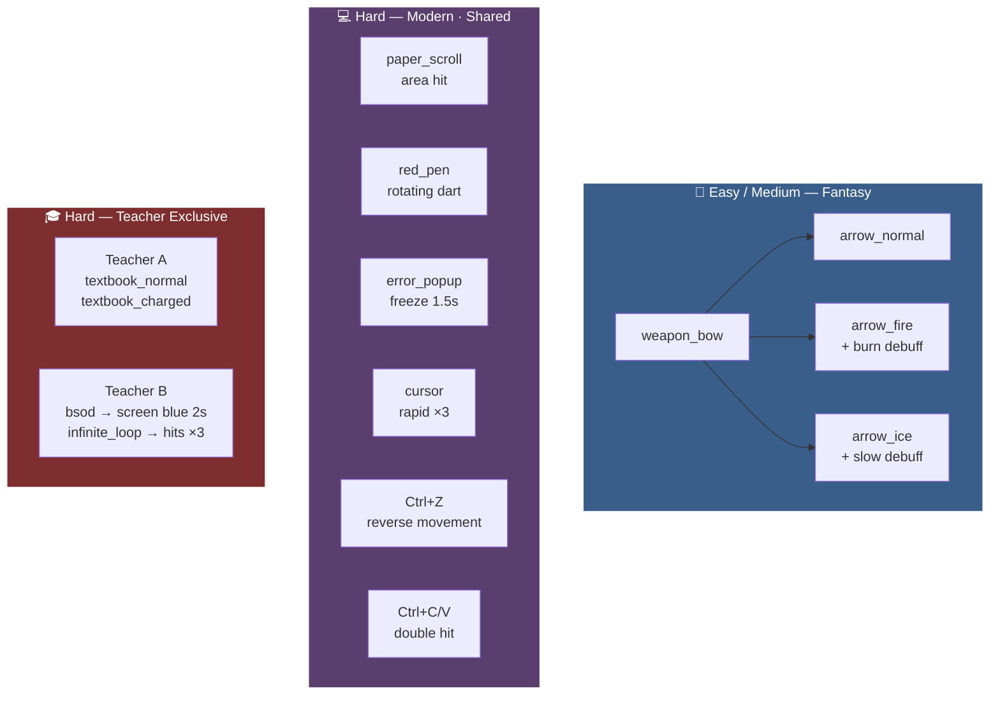

# 🎮 Merchant Fighter — UI Flow

> This document describes the screen navigation flow and UI elements for each screen.
> For full element specs, see [`docs/ArtAssetList.md`](./ArtAssetList.md).

---

## Navigation Flow

---

## Screen Details

### Screen 1 — Start Screen

---

### Screen 2 — Difficulty Select

---

### Screen 3a — Character Select (Fantasy Route)

---

### Screen 3b — Character Select (Modern Route)

---

### Screen 4 — Battle Screen

> Same layout for both Fantasy and Modern routes. Visual assets differ per route.

---

### Screen 5 — Victory / Defeat Screen

---

## Weapon System Flow

---

*Last updated: 2026-03-11 | See [`ArtAssetList.md`](./ArtAssetList.md) for full asset specs.*
